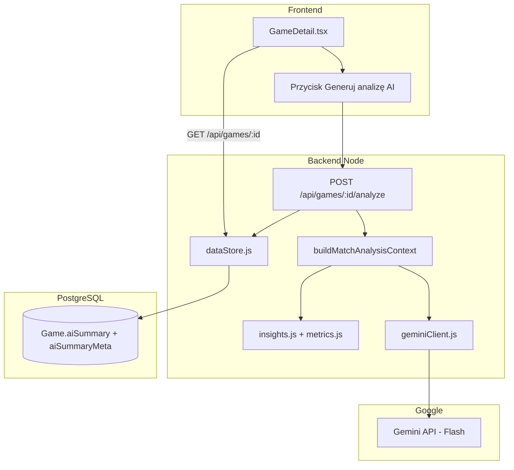
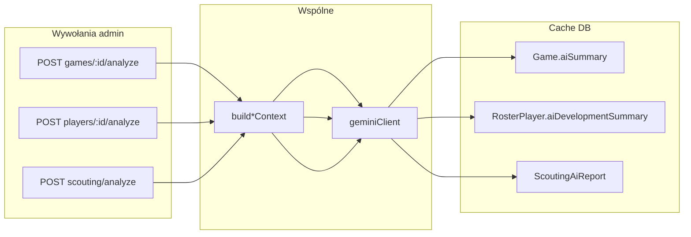

# Plan implementacji: analizy AI (Gemini) — mecze, zawodnicy, scouting

**Status:** zaimplementowane (2026-05-28) — plan treningu (E) odłożony  
**Data:** 2026-05-28 (rozszerzenie: zawodnicy + scouting)  
**Cel:** Tekstowe analizy po polsku (bez wideo), cache w DB, jeden provider (Google Gemini Flash), minimalny koszt API.

## Trzy produkty AI (jedna infrastruktura)

| Produkt | Dla kogo | Dane wejściowe (już w app) | UI dziś | Stan „AI” dziś |
|---------|----------|------------------------------|---------|----------------|
| **A. Analiza meczu** | Trener po imporcie protokołu | `Game` — box score, kwarty, `insights.js` | `GameDetail` | Brak LLM |
| **B. Plan rozwoju zawodnika** | Zawodnik / trener | `getPlayerStats` — game log, średnie; opcjonalnie `goals` | `PlayerProfile` | Brak LLM |
| **C. Scouting rywala** | Przed meczem ligowym | `getDetailedScouting` — tabela, KALK, forma, four factors | `ScoutingPage` → „AI Game Plan” | **Szablony tekstowe** w `dataStore.js` (nie prawdziwe AI) |

Wszystkie trzy mogą używać tego samego modułu `backend/ai/geminiClient.js` i tej samej zasady: **generuj na żądanie (admin) → zapisz w DB → czytaj bez ponownego wołania API**.

---

## 1. Założenia produktowe

### W zakresie (MVP)

- Analiza **tylko meczów BeKaPaKa** z pełnym box score (`Game` w PostgreSQL po imporcie protokołu).
- Język: **polski**, ton: trener / sztab (konkret, bez „lania wody”).
- Wejście: metryki z `metrics.js`, reguły z `insights.js`, zwarty JSON (wynik, kwarty, statystyki drużyn i zawodników).
- Wyjście: tekst Markdown (nagłówki + listy), zapisany w bazie — **jedno wywołanie API na generację**, potem tylko odczyt z DB.
- Uruchomienie: **tylko ADMIN** (przycisk na `GameDetail` lub w panelu importu).
- Model domyślny: **`gemini-2.5-flash`** (tańszy / często w free tier API; wystarczy przy ~1–2k tokenów wyjścia).

### Poza zakresem (MVP)

- Analiza wideo, OCR protokołów PDF, zdjęć.
- Automatyczne generowanie po każdym `GET /api/games/:id`.
- Analiza meczów ligowych bez protokołu (`LeagueMatch` — tylko wynik, bez box score).
- Publiczny endpoint bez autoryzacji.
- Równoległe porównanie wielu dostawców (NVIDIA, OpenAI) — opcjonalnie później przez wspólny interfejs.

---

## 2. Subskrypcja Gemini Pro vs API

| | Gemini Pro (subskrypcja) | Gemini API (integracja) |
|---|--------------------------|-------------------------|
| Użycie | [AI Studio](https://aistudio.google.com) — dopracowanie promptu | Backend BeKaPaKa na VPS |
| Klucz | — | `GEMINI_API_KEY` z AI Studio (konto Google) |
| Rozliczenie | Subskrypcja | Osobny tier API (Flash często wystarcza przy waszym wolumenie) |

**Rekomendacja:** prompt projektować w AI Studio (to samo konto co Pro), w produkcji wołać **Flash** z cache. Subskrypcja Pro **nie zastępuje** klucza API w aplikacji.

---

## 3. Architektura



### Warstwy odpowiedzialności

| Moduł | Plik (propozycja) | Odpowiedzialność |
|-------|-------------------|------------------|
| Kontekst meczu | `backend/ai/buildMatchAnalysisContext.js` | JSON + insights z istniejącej logiki |
| Klient Gemini | `backend/ai/geminiClient.js` | Wywołanie API, timeout, błędy |
| Prompt | `backend/ai/prompts/matchAnalysis.pl.js` | Stały system prompt + szablon user |
| Orkiestracja | `backend/ai/generateMatchAnalysis.js` | Spójny flow: context → API → walidacja → zapis |
| Persystencja | `backend/dataStore.js` | `saveGameAiSummary`, `clearGameAiSummary` |
| HTTP | `backend/server.js` | Route + auth admin |
| UI | `frontend/src/pages/GameDetail.tsx` | Wyświetlenie + akcja admin |

---

## 4. Model danych (Prisma)

### Nowe pola w `Game`

```prisma
model Game {
  // ... istniejące pola ...

  aiSummary       String?   @db.Text    // Markdown raportu
  aiSummaryAt     DateTime?             // kiedy wygenerowano
  aiSummaryModel  String?               // np. "gemini-2.5-flash"
  aiSummaryHash   String?               // hash kontekstu — invalidacja cache
}
```

**Dlaczego osobne pola, a nie `notes`?**

- `notes` = ręczne notatki trenera (edytowalne).
- `aiSummary` = generowane, można nadpisać przyciskiem „Generuj ponownie”.
- Hash pozwala wykryć, że mecz się zmienił (re-import) i pokazać „Analiza nieaktualna”.

### Migracja

1. `npx prisma migrate dev --name add_game_ai_summary`
2. Na VPS: `prisma migrate deploy` w kontenerze backend (jak w runbooku).

---

## 5. Budowa kontekstu (pseudokod)

```text
FUNCTION buildMatchAnalysisContext(gameId):
  game ← getGameById(gameId)  // już liczy fourFactors + insights

  IF game brak w prisma.game OR brak teamStats/data.teams z box score:
    THROW "Brak pełnych statystyk — zaimportuj protokół"

  bekapaka, opponent ← z game.teams / teamStats
  payload ← {
    meta: { date, opponent, result, scoreUs, scoreThem, homeAway },
    quarters: game.quarters,
    teamComparison: {
      bekapaka: { fourFactors, keyTeamStats },
      opponent: { fourFactors, keyTeamStats }
    },
    topPlayers: {
      bekapaka: top 5 po pts/eval (skrócone kolumny),
      opponent: top 3 (opcjonalnie)
    },
    ruleInsights: game.insights,  // z insights.js
    optionalTrend: last 3 games summary IF ≤ 800 tokenów  // faza 2
  }

  hash ← sha256(JSON.stringify(payload))
  RETURN { payload, hash }
```

**Zasady redukcji tokenów**

- Nie wysyłać surowego Markdown protokołu.
- Zawodnicy: tylko `name, number, min, pts, reb, ast, tov, fgm/fga, three, ft, eval, plusMinus`.
- Pomijać puste / zerowe sekcje.

---

## 6. Prompt (szkic)

### System (stały)

- Rola: analityk koszykówki amatorskiej, język polski.
- Ograniczenia: **tylko dane z JSON**; jeśli brak — napisać „brak danych”.
- Zakaz: wymyślanie statystyk, porady medyczne, wideo.
- Format wyjścia (Markdown):
  1. Podsumowanie (2–3 zdania)
  2. Co zadziałało (3–5 punktów)
  3. Obszary do poprawy (3–5 punktów)
  4. Kluczowi zawodnicy
  5. Kwarty / przebieg meczu
  6. Jedna rekomendacja na następny trening

### User (dynamiczny)

```text
Przeanalizuj mecz BeKaPaKa na podstawie JSON:

{payload}

Uwzględnij wnioski regułowe (już obliczone):
{ruleInsights}
```

**Kalibracja:** 2–3 mecze testowe w AI Studio; skopiować finalny system prompt do repo.

---

## 7. API HTTP

### `POST /api/games/:id/analyze`

| Aspekt | Wartość |
|--------|---------|
| Auth | `authenticateToken` + `requireAdmin` |
| Body | `{ "force": false }` — `force: true` pomija cache |
| Sukces 200 | `{ aiSummary, aiSummaryAt, model, cached: boolean }` |
| 400 | Brak statystyk / mecz ligowy bez protokołu |
| 404 | Nieznany id |
| 409 | Generacja już trwa (flaga in-memory na instancji) |
| 503 | Brak `GEMINI_API_KEY` lub błąd Gemini |

**Logika cache**

```text
IF NOT force AND game.aiSummary AND game.aiSummaryHash === context.hash:
  RETURN cached

ELSE:
  text ← callGemini(...)
  save aiSummary, aiSummaryAt, aiSummaryModel, aiSummaryHash
  RETURN fresh
```

### `DELETE /api/games/:id/analyze` (opcjonalnie, faza 1b)

- Czyści `aiSummary*` — admin przed re-generacją.

### Rozszerzenie `GET /api/games/:id`

- Zwracać pola `aiSummary`, `aiSummaryAt`, `aiSummaryStale` (porównanie hash vs aktualny kontekst — liczone on-the-fly bez wołania Gemini).

### Dokumentacja

- Aktualizacja `docs/api.md` po implementacji.

---

## 8. Backend — zależności i env

### Pakiet

```bash
npm install @google/genai
```

Oficjalny SDK Google Gen AI (zamiast przestarzałego `@google/generative-ai`, jeśli dokumentacja wskazuje migrację — sprawdzić w AI Studio przy implementacji).

### Zmienne środowiskowe

| Zmienna | Wymagane | Domyślnie | Opis |
|---------|----------|-----------|------|
| `GEMINI_API_KEY` | tak (do generacji) | — | Klucz z AI Studio |
| `GEMINI_MODEL` | nie | `gemini-2.5-flash` | Model |
| `GEMINI_TIMEOUT_MS` | nie | `60000` | Timeout requestu |
| `AI_ANALYSIS_ENABLED` | nie | `true` | Kill switch na VPS |

**docker-compose.prod.yml** — dodać do `bkpk-backend.environment` (wartość z `.env` na VPS, **nie** commitować klucza).

### `geminiClient.js` (pseudokod)

```text
FUNCTION generateText({ system, user }):
  IF NOT GEMINI_API_KEY: THROW ConfigError

  response ← genai.models.generateContent({
    model: GEMINI_MODEL,
    contents: [...],
    config: { temperature: 0.4, maxOutputTokens: 2048 }
  })

  RETURN trimmed markdown text
  ON rate limit: map to 503 + komunikat PL
  ON safety block: 422 + komunikat
```

---

## 9. Frontend

### `GameDetail.tsx`

1. Sekcja **„Analiza AI”** (pod „Inteligentne Wnioski” lub nad notatkami trenera).
2. Wyświetlanie `aiSummary` przez istniejący `ReactMarkdown` + `remarkGfm` (jak notatki).
3. Badge: data generacji + model.
4. Jeśli `aiSummaryStale` → ostrzeżenie + przycisk „Odśwież analizę”.
5. Przycisk **„Generuj analizę AI”** — widoczny tylko gdy `user.role === 'ADMIN'` (jak w `Shell.tsx`).
6. Stan: `analyzing`, spinner, błąd z API w toast/alert.

### API client

```text
postJSON(`/api/games/${id}/analyze`, { force: false })
```

Nagłówek `Authorization: Bearer` — już w `fetchJSON` / kontekście auth.

### UX

- Pierwsze wejście: pusta sekcja + CTA dla admina.
- Zwykły użytkownik (USER): tylko odczyt gotowej analizy, jeśli admin ją wygenerował (decyzja produktowa: **tak** — cała drużyna widzi raport).

---

## 10. Koszt i limity

| Scenariusz | Szacunek |
|------------|----------|
| 15 meczów / sezon, 1 analiza / mecz | ~15 wywołań API / sezon |
| Tokeny / mecz | ~3–10k input, ~1–2k output |
| Koszt Flash | Zwykle **0–kilka PLN/rok** przy cache |
| Re-generacja po edycji protokołu | Tylko gdy admin kliknie lub `force: true` |

**Zasady oszczędzania**

- Nigdy nie wołać Gemini w `getGameById` dla każdego requestu.
- Opcjonalnie: po udanym `POST /api/import` — **sugestia** w odpowiedzi `"suggestAiAnalysis": true` bez auto-wywołania (żeby import nie trwał 30s dłużej).

---

## 11. Bezpieczeństwo i RODO

- Klucz API **tylko** na serwerze; nigdy w frontendzie.
- Logi: nie zapisywać pełnego promptu z nazwiskami na produkcji (max. `gameId` + hash).
- Krótka informacja w panelu admin: dane statystyczne trafiają do Google (link do polityki Google AI).
- Endpoint wyłącznie dla ADMIN generacji; odczyt raportu — wg decyzji (domyślnie wszyscy zalogowani z dostępem do meczu).

---

## 12. Fazy wdrożenia

### Faza 1 — MVP (1–2 sesje dev)

1. Migracja Prisma + `dataStore` save/load pól AI.
2. `buildMatchAnalysisContext` + `generateMatchAnalysis` + `geminiClient`.
3. `POST /api/games/:id/analyze` + testy jednostkowe mock Gemini.
4. UI w `GameDetail` (admin generate, wszyscy read).
5. Env w `docker-compose.prod.yml` + wpis w `docs/vps-runbook.md`.
6. Aktualizacja `docs/api.md`, link z `AGENTS.md`.

### Faza 2 — jakość

1. Trend z ostatnich 3 meczów w kontekście (jeśli mieści się w limitach).
2. `aiSummaryStale` w GET.
3. Opcjonalnie: przycisk w `Administration` — lista meczów bez analizy.

### Faza 3 — opcjonalnie

1. Eksport PDF analizy (frontend print).
2. Porównanie z scoutingiem rywala (`getDetailedScouting`) w jednym prompcie.
3. Abstrakcja `AiProvider` jeśli kiedyś drugi model.

---

## 13. Testy

| Typ | Co sprawdzać |
|-----|----------------|
| Unit | `buildMatchAnalysisContext` — hash stabilny, skrócone payloady |
| Unit | cache hit gdy hash się zgadza |
| Unit | `generateMatchAnalysis` z mockiem Gemini — zapis do Prisma |
| Unit | brak klucza API → 503 |
| Manual | 1 mecz W, 1 mecz L — sensowność PL, brak zmyślonych liczb |
| Manual | AI Studio vs backend — ten sam prompt, podobna jakość |

**Fixtures:** istniejący mecz z `sample-data` lub zapisany JSON z importu w `backend/tests/fixtures/`.

---

## 14. Kryteria akceptacji (Definition of Done)

- [ ] Admin może wygenerować analizę z `GameDetail` dla meczu z box score.
- [ ] Analiza zapisuje się w DB i po odświeżeniu strony jest widoczna bez ponownego wołania Gemini.
- [ ] Ponowne kliknięcie bez zmiany danych zwraca `cached: true` (bez kosztu API).
- [ ] Po zmianie statystyk meczu (re-import) UI pokazuje, że analiza jest nieaktualna.
- [ ] Brak `GEMINI_API_KEY` — czytelny komunikat, aplikacja działa dalej (insights regułowe bez zmian).
- [ ] Klucz API nie trafia do repozytorium.
- [ ] Dokumentacja: `docs/api.md`, env w runbooku.

---

## 15. Checklist przed pierwszym deployem na VPS

1. Klucz API w `/opt/bekapaka-stats/.env` → `GEMINI_API_KEY=...`
2. `GEMINI_MODEL=gemini-2.5-flash`
3. Rebuild obrazu backend + `migrate deploy`
4. Test jednego meczu przez panel admin na produkcji
5. Sprawdzenie limitów w [AI Studio → Billing](https://aistudio.google.com)

---

## 16. Powiązane pliki (stan obecny)

| Plik | Rola dziś |
|------|-----------|
| `backend/insights.js` | Reguły — zostają, uzupełniają AI |
| `backend/metrics.js` | eFG%, TS%, TO% — źródło prawdy liczb |
| `backend/dataStore.js` → `getGameById` | Liczy `insights` przy odczycie |
| `frontend/src/pages/GameDetail.tsx` | UI meczu — miejsce na sekcję AI |
| `backend/server.js` | Routing — nowy endpoint analyze |

---

---

## 17. Produkt B — analiza zawodnika („nad czym pracować”)

### Cel

Krótki plan rozwoju na podstawie **waszych meczów z protokołami** (nie ligowych statów KALK jako jedynego źródła — KALK może być kontekstem dodatkowym).

### Dane (już dostępne)

- `GET /api/players/:id/stats` → `gameLog`, `averages` (`dataStore.getPlayerStats`)
- `RosterPlayer.goals` (JSON) — cele ustawione ręcznie; AI może je **odnosić** w tekście, nie nadpisywać automatycznie w MVP
- Porównanie do średniej drużyny: `getTrainingPriorities()` lub prosta średnia z ostatnich 10 meczów

### Reguły przed LLM (darmowe, deterministyczne)

Nowy plik np. `backend/ai/playerSignals.js` — flagi na podstawie liczb:

```text
- tovPerGame > próg drużyny + 20%  → "redukcja strat"
- ft% < 60% i fta >= 3/mecz        → "rzuty wolne"
- efg trend: ostatnie 3 vs poprzednie 3 → spadek/wzrost
- plusMinus średnio ujemny         → "wpływ na boisko"
- mało minut a dobre ratio         → "więcej czasu przy dobrej skuteczności"
```

Te flagi trafiają do JSON w prompcie jako `computedSignals` — LLM tylko **tłumaczy i priorytetyzuje**, nie wymyśla liczb.

### Pola w bazie (`RosterPlayer`)

```prisma
  aiDevelopmentSummary   String?   @db.Text   // Markdown
  aiDevelopmentAt        DateTime?
  aiDevelopmentModel     String?
  aiDevelopmentHash      String?              // hash(gameLog + goals)
```

### Endpoint

`POST /api/players/:id/analyze` — admin, cache jak przy meczu.

### Format wyjścia (Markdown)

1. Profil zawodnika (2 zdania)
2. Mocne strony (3 punkty, z liczbami)
3. Do poprawy — **max 3 priorytety treningowe** (konkret: np. „decyzje po dribblingu”, nie ogólniki)
4. Trend (ostatnie 3 vs wcześniejsze mecze)
5. Sugerowane ćwiczenia / fokus na najbliższym treningu (3 bulletów)
6. Jeśli są `goals` w DB — sekcja „Cele sezonu vs stan faktyczny”

### UI

- `PlayerProfile.tsx` — sekcja „Plan rozwoju (AI)” + przycisk admin „Generuj / odśwież”
- Zwykły zawodnik (USER): **odczyt** gotowej analizy (jeśli wygenerowana) — decyzja produktowa: zalecane **tak** (motywacja)

### Ograniczenia

- Minimum **3 mecze** w game log — inaczej 400 z komunikatem „Za mało danych”.
- Brak meczu = brak analizy per-zawodnik (KALK alone nie zastępuje box score z protokołu).

---

## 18. Produkt C — scouting meczów (prawdziwe AI zamiast szablonów)

### Stan obecny (ważne)

W `getDetailedScouting()` pole `aiAnalysis` (summary, offense, defense, verdict) jest **składane z if-ów i stringów** — frontend `AIAnalysisSection` wygląda jak AI, ale to **reguły szablonowe** (pace, TO%, forma z 5 meczów).

Gemini ma **zastąpić generowanie treści**, zachowując resztę strony (radar, skład, DNA) bez zmian.

### Dane wejściowe do scoutingu

| Źródło | Co daje |
|--------|---------|
| `LeagueTeam` | miejsce w tabeli, PPG, punkty zdobyte/stracone |
| `LeagueMatch` (ostatnie 5) | forma, wyniki |
| `KalkPlayer` (top 5 rywala) | strzelcy, średnie ligowe |
| `getOpponentAdvancedStats()` | pace, shot profile, four factors z meczów **z protokołem** (`protocolUrl`) — jeśli brak protokołów, four factors mogą być puste |
| `getNextOpponentScouting()` | nadchodzący mecz, data |
| Opcjonalnie | Wasze `Game` vs tego rywala (jeśli kiedyś graliście — rzadkie w lidze) |

### Pola w bazie — cache per rywal

Opcja A (prosta): tabela `ScoutingAiReport`

```prisma
model ScoutingAiReport {
  opponentKey   String   @id   // znormalizowana nazwa, np. slug
  opponentName  String
  summaryMd     String   @db.Text
  model         String?
  sourceHash    String?
  generatedAt   DateTime?
}
```

Opcja B: pola JSON w istniejącym flow — mniej przejrzyste; **rekomendacja: Opcja A**.

`opponentKey` = `normalizeOpponentName(name)` (jak `simplifiedName` w `getOpponentAdvancedStats`).

### Endpoint

`POST /api/scouting/analyze?opponent=GLAZURIX` — admin.

- Po generacji: zapis do `ScoutingAiReport`
- `GET /api/scouting/detailed` — jeśli jest cache i hash aktualny → **podmień** `aiAnalysis` na sparsowane sekcje LUB dodaj pole `aiAnalysisMd` i renderuj Markdown w `AIAnalysisSection`

### Format wyjścia (Markdown → sekcje jak dziś)

1. **Podsumowanie stylu** (tempo, forma, profil rzutowy)
2. **Ich ofensywa** — kluczowi gracze, jak zdobywają punkty
3. **Ich defensywa** — słabości do ataku
4. **Klucz do zwycięstwa** — 3 konkretne taktyki dla BeKaPaKa
5. **Ryzyka** — czego unikać (np. faule, tempo)
6. **Checklista przed meczem** — 5 punktów dla szatni

### Kiedy odświeżać cache

- Po `POST /api/scrape/kalk/div2/run` (nowe statystyki ligowe) — oznacz raporty jako `stale`, nie auto-generuj (koszt)
- Admin: „Odśwież scouting AI” na `ScoutingPage`

### Jakość danych — uczciwie

Scouting ligowy **bez protokołów rywali** = słabszy niż analiza **waszego** meczu z box score. W prompcie: model musi napisać, że wnioski opierają się na tabeli/KALK, a nie na pełnym box score rywala.

---

## 19. Wspólna architektura AI (wszystkie produkty)

```text
backend/ai/
  geminiClient.js              # jeden klient
  generate.js                  # orchestrator: type + id → context → API → save
  buildMatchContext.js         # produkt A
  buildPlayerContext.js        # produkt B
  buildScoutingContext.js      # produkt C
  playerSignals.js             # reguły B
  prompts/
    matchAnalysis.pl.js
    playerDevelopment.pl.js
    scoutingOpponent.pl.js
```



---

## 20. Szacunek kosztów (cały sezon)

| Akcja | Ilość / sezon | Wywołań API |
|-------|----------------|-------------|
| Analiza meczu | ~15 meczów | ~15 |
| Zawodnik | ~12 zawodników × 1–2 odświeżenia | ~20 |
| Scouting | ~12 rywali × 1 | ~12 |
| **Razem** | | **~50** |

Przy Flash i cache: **praktycznie darmowe** w skali amatorskiej.

---

## 21. Fazy wdrożenia (zaktualizowane)

### Faza 1 — fundament + mecz (bez zmian sekcji 12)

Infrastruktura `backend/ai/*`, env, analiza meczu.

### Faza 2 — zawodnicy

`playerSignals.js`, pola Prisma na `RosterPlayer`, endpoint, UI `PlayerProfile`.

### Faza 3 — scouting

`ScoutingAiReport`, endpoint, podmiana szablonów w `getDetailedScouting` / UI `ScoutingPage`.

### Faza 4 — wygodzie

- Panel admin: lista „brak analizy AI”
- Po imporcie meczu: toast „Wygeneruj analizę meczu?”
- Opcjonalnie: batch „odśwież wszystkich zawodników” (z limitem 1/min)

---

## 22. Kryteria akceptacji (rozszerzone)

**Zawodnik**

- [ ] Admin generuje plan rozwoju przy ≥3 meczach w logu
- [ ] Tekst zawiera ≥3 konkretne priorytety oparte o liczby z JSON
- [ ] Ponowne generowanie bez zmian danych = cache

**Scouting**

- [ ] Admin generuje raport dla wybranego rywala
- [ ] `ScoutingPage` pokazuje treść z Gemini, nie tylko szablony
- [ ] Po scrape KALK raport oznaczony jako nieaktualny (bez auto-API)

---

## 23. Audyt aplikacji — co jeszcze AI może dać (2026-05-28)

Przegląd wszystkich ekranów i endpointów pod kątem **dodatkowej** wartości LLM (poza produktami A/B/C).

### Mapa aplikacji vs AI

| Obszar | Dane | AI dziś / plan | Werdykt |
|--------|------|----------------|---------|
| **GameDetail** | Box score, kwarty, insights | Plan A — analiza meczu | **Tak — priorytet 1** |
| **PlayerProfile** | Game log, średnie, goals | Plan B — plan rozwoju | **Tak — priorytet 2** |
| **ScoutingPage** | Liga, KALK, forma | Plan C — zamiast szablonów | **Tak — priorytet 3** |
| **Dashboard** | Ostatni mecz, next match, priorities, scouting | Brak | **Tak — briefing (patrz D)** |
| **Trends** | `getTeamTrends`, porównanie ligi | `generateTrendInsights` **nieużywane** | **Częściowo — wchodzi w D lub rozszerzenie A** |
| **TrainingPrioritiesCard** | Reguły FT/TO/rebounds | Reguły w UI | **Nie osobny LLM — wystarczy rozszerzyć reguły** |
| **Training** | Obecności, `focus[]` w DB | UI słabe, brak AI | **Tak — plan treningu (E), faza 4** |
| **Protocols** | Import Markdown, walidacja | Parser deterministyczny | **Raczej nie** (patrz niżej) |
| **League** | Tabela, terminarz, strzelcy | Tylko tabele | **Nie** — mało wartości vs koszt |
| **Roster** | Agregaty PPG/RPG | — | **Nie osobno** — pokrywa Plan B |
| **GameCenter** | Lista meczów | — | **Nie** |
| **Administration** | Scraper KALK | — | **Nie** (logi techniczne) |
| **Play (`/api/plays`)** | Model + API, **brak UI** | — | **Później**, po Strategy Room |
| **MVP, notatki trenera** | Pola ręczne | — | **Nie** — pokryte analizą meczu + ręczna edycja |
| **Wideo** | `videoUrl` | — | **Wykluczone** |

### Produkty dodatkowe warte rozważenia

#### D. Briefing tygodniowy (Dashboard) — **REKOMENDOWANE (faza 4)**

**Co:** Jedna kartka „Co ważne teraz”: wynik ostatniego meczu (1 akapit), forma z trendów (3 mecze), priorytety treningowe (z liczb), nadchodzący rywal (skrót ze scoutingu).

**Wejście:** `getTeamTrends`, `getTrainingPriorities`, `getNextOpponentScouting`, ostatni `Game` z protokołem — bez nowych danych.

**Wyjście:** Markdown, cache globalny `TeamBriefing` (1 rekord, hash sezonu + data ostatniego meczu).

**Endpoint:** `POST /api/ai/briefing/generate` (admin, max 1×/tydzień sensownie).

**Dlaczego:** Jedno wywołanie API zamiast trzech osobnych raportów dla trenera wchodzącego na Dashboard — wysoka użyteczność, niski koszt.

**Uwaga:** Nie duplikować pełnej analizy meczu — tylko **skrót** + link „Szczegóły w Game Center”.

---

#### E. Plan treningu zespołu — **REKOMENDOWANE (faza 4–5)**

**Co:** Na stronie `Training` — propozycja `focus[]` + opis 45–60 min (rozgrzewka, główna część, game-like) na podstawie priorytetów drużyny i ostatniego meczu.

**Wejście:** `getTrainingPriorities`, ostatni mecz (four factors), opcjonalnie obecności z ostatnich treningów.

**Wyjście:** JSON `{ focus: string[], planMd: string }` zapisany w `Training.notes` lub osobnym polu przy tworzeniu treningu.

**Dlaczego:** Schema `Training.focus` już istnieje, UI tego nie wykorzystuje — AI wypełnia lukę produktową.

---

#### F. Punkty do szatni (pre-game) — **OPCJONALNE (sekcja w C, nie osobny produkt)**

**Co:** 5–7 zdań przed meczem: tempo, kluczowy rywal z KALK, jedna taktyka.

**Werdykt:** Wbudować w prompt scoutingu (sekcja 6 planu C — „Checklista szatni”), **nie** osobny endpoint.

---

### Co **nie** warto robić z AI

| Pomysł | Powód |
|--------|--------|
| **Parsowanie protokołu zamiast `parser.js`** | LLM bywa niedokładny przy tabelach; macie działający parser + walidację w `Protocols.tsx`. Ewentualnie tylko „wyjaśnij błąd walidacji” — niski ROI. |
| **Komentarz do tabeli ligi** | Dane są czytelne wizualnie; AI nie doda wiele. |
| **Auto-MVP** | Reguła `max(pts)` / eval wystarczy. |
| **Porównanie dwóch zawodników (osobny moduł)** | Rzadki przypadek; trener może przeczytać dwa profile B. |
| **Obecność na treningach vs forma** | Mało wpisów obecności w DB — za słabe dane. |
| **Generowanie playbooków (`Play`)** | Brak UI; najpierw Strategy Room, potem ewentualnie AI. |
| **Heatmapa treningów** (wspomniana w user-guide) | **Nie zaimplementowana** — to feature dev, nie AI. |

### Nakładanie się funkcji — jak uniknąć duplikatów

```text
Analiza meczu (A)     = głęboko, jeden mecz, po imporcie
Plan zawodnika (B)    = sezon / log, indywidualnie
Scouting (C)          = rywal, przed meczem ligowym
Briefing (D)          = skrót wielu źródeł, Dashboard
Plan treningu (E)     = praktyka na boisku, Training
Szatnia (F)           = podzbiór C
```

Reguły `insights.js` + `TrainingPrioritiesCard` **zostają** — AI je **cytuje**, nie zastępuje.

### Zaktualizowana kolejność faz

| Faza | Zakres |
|------|--------|
| 1 | Fundament Gemini + analiza **meczu** |
| 2 | Analiza **zawodnika** |
| 3 | **Scouting** (+ szatnia w prompcie) |
| 4 | **Briefing** Dashboard |
| 5 | **Plan treningu** |
| — | Playbook, import-assist, liga — **pominąć** do czasu nowych wymagań |

### Szacunek API po pełnym wdrożeniu (sezon)

| Produkt | Wywołania / sezon |
|---------|-------------------|
| A Mecz | ~15 |
| B Zawodnik | ~20 |
| C Scouting | ~12 |
| D Briefing | ~15 (np. co 2 tyg.) |
| E Trening | ~20 |
| **Razem** | **~80** → nadal okolice darmowego tieru Flash |

---

## Następny krok

Po akceptacji planu: implementacja **Fazy 1** (fundament + mecz), potem **Faza 2** (zawodnicy), **Faza 3** (scouting), opcjonalnie **4–5** (briefing + trening).

Pełny audyt: sekcja **23** powyżej.
