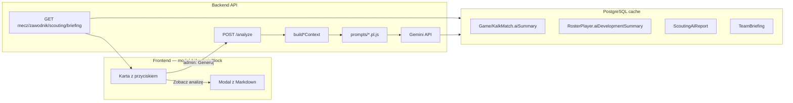

# Raport: Analizy AI w BeKaPaKa

**Data:** 2026-06-05  
**Status:** zaimplementowane (Gemini Flash + cache w PostgreSQL)  
**Ostatnia aktualizacja promptów:** 2026-06-05 — reguła sfalsyfikowalności, wymuszenie liczb per sekcja, priorytetyzacja `signals` / `ruleInsights`

System ma **4 produkty AI** oparte na **Google Gemini** (`gemini-2.5-flash` domyślnie). Wszystkie używają wspólnego klienta `backend/ai/geminiClient.js` i cache w bazie danych.

**Reguła nadrzędna (wszystkie prompty):** każde zdanie musi być możliwe do sfalsyfikowania na podstawie JSON wejściowego. Zdanie przenoszalne do innego meczu/zawodnika/rywala bez zmiany = błąd.

Powiązana dokumentacja: [ai-match-analysis-plan.md](./ai-match-analysis-plan.md)

---

## Architektura przepływu danych



**Ważne:** Modal AI **nie wysyła nic do Gemini**. Dostaje już wygenerowany tekst z API/DB przez propsy komponentu nadrzędnego.

---

## Modal `AiAnalysisBlock` — co faktycznie dostaje

Komponent: `frontend/src/components/ai/AiAnalysisBlock.tsx`

| Prop | Źródło | Opis |
|------|--------|------|
| `title` | strona nadrzędna | np. „Analiza meczu (AI)” |
| `content` | DB → API → state | Główny tekst Markdown (lub JSON parsowany do MD) |
| `structuredContent` | scouting | Obiekt `{ summary, offense, defense, verdict, personnel?, lockerRoom? }` |
| `generatedAt` | DB | Data generacji |
| `model` | DB | np. `gemini-2.5-flash` |
| `canGenerate` | `user.role === 'ADMIN'` | Czy pokazać przyciski generacji |
| `onGenerate(force?)` | handler strony | Woła `POST /api/.../analyze` |
| `staleHint` | hash vs aktualne dane | Ostrzeżenie o nieaktualnym cache |
| `sourceLabel` | scouting | „Gemini” lub „Szablon danych” |

**Modal renderuje:** `ReactMarkdown` + `remarkGfm` — pełny raport w overlay (mobile: bottom sheet, desktop: dialog).

### Gdzie używany

| Strona | Tytuł modala | Pole `content` |
|--------|--------------|----------------|
| `GameDetail` | Analiza meczu (AI) | `game.aiSummary` |
| `PlayerProfile` / `Profile` | Plan rozwoju (AI) | `aiDevelopmentSummary` |
| `ScoutingPage` | Plan meczowy (AI) | `scoutingSummaryMd` + `structuredContent` |
| `ScoutingPage` | Analiza kadry (AI) | `personnelMd` |
| `Dashboard` | Briefing tygodniowy (AI) | `briefing.contentMd` |

---

## Konfiguracja Gemini (wspólna)

| Parametr | Wartość |
|----------|---------|
| Model | `GEMINI_MODEL` → domyślnie `gemini-2.5-flash` |
| Temperatura | `0.35` |
| Max tokeny wyjścia | `2048` (mecz, briefing) / `4096` (zawodnik, scouting) |
| JSON mode | `true` dla zawodnika i scoutingu |
| Klucz | `GEMINI_API_KEY` (tylko backend) |
| Kill switch | `AI_ANALYSIS_ENABLED=false` |
| Timeout | `GEMINI_TIMEOUT_MS` → domyślnie `60000` |

Plik: `backend/ai/geminiClient.js`

---

## Produkt A — Analiza meczu

### Endpointy

| Metoda | Ścieżka | Auth |
|--------|---------|------|
| `POST` | `/api/games/:id/analyze` | ADMIN |
| `GET` | `/api/games/:id` | zalogowany (odczyt `aiSummary`) |

Body generacji: `{ "force": false }` — `force: true` pomija cache.

### Cache DB

- `Game.aiSummary` (archiwum legacy)
- `KalkMatch.aiSummary` (mecze po sync KALK)
- Pola: `aiSummaryAt`, `aiSummaryModel`, `aiSummaryHash`

### Prompt systemowy

Plik: `backend/ai/prompts/matchAnalysis.pl.js`

```text
ZASADY (skrót):
- Reguła sfalsyfikowalności — każde zdanie z liczbą lub faktem z JSON/ruleInsights.
- "Co zadziałało": liczba w każdym punkcie; wpisy type=success z ruleInsights obowiązkowo.
- "Do poprawy": każdy type=warning z ruleInsights; fallback gdy brak warningów.
- "Rekomendacja na trening": wynika z "Do poprawy", start "Na podstawie [słabość]...".
- "Kluczowi zawodnicy": imię + numer + min. 3 statystyki + plusMinus.
- "Przebieg kwart": wynik parcjalny + jedna obserwacja liczbowa per kwarta.
```

Pełna treść: [`backend/ai/prompts/matchAnalysis.pl.js`](../backend/ai/prompts/matchAnalysis.pl.js)

### Prompt użytkownika (dynamiczny)

```text
Przeanalizuj mecz BeKaPaKa ({result}: {scoreUs}–{scoreThem} vs {opponent}, {date}).

WAŻNE: Wnioski regułowe są faktami — type=warning → "Do poprawy", type=success → "Co zadziałało".

Wnioski regułowe:
{ruleInsights JSON}

Pełne dane meczu (bez duplikatu ruleInsights):
{payload JSON}
```

### Dane wejściowe do Gemini

Plik: `backend/ai/buildMatchContext.js`

```json
{
  "meta": {
    "date": "...",
    "opponent": "...",
    "result": "W|L",
    "scoreUs": 0,
    "scoreThem": 0,
    "homeAway": "..."
  },
  "quarters": [],
  "teamComparison": {
    "bekapaka": { "name": "...", "fourFactors": {}, "pts": 0 },
    "opponent": { "name": "...", "fourFactors": {}, "pts": 0 }
  },
  "topPlayers": {
    "bekapaka": [
      {
        "name": "...",
        "number": 0,
        "min": "...",
        "pts": 0,
        "reb": 0,
        "ast": 0,
        "tov": 0,
        "fg": "0/0",
        "three": "0/0",
        "ft": "0/0",
        "plusMinus": 0,
        "eval": 0
      }
    ],
    "opponent": []
  },
  "ruleInsights": []
}
```

**Źródło danych:** `getGameById()` → box score KALK, four factors (`metrics.js`), insights (`insights.js`).

**Reguły insights (przed LLM)** — `backend/insights.js`:

| Warunek | Typ | Kategoria |
|---------|-----|-----------|
| TO% > 20% | warning | efficiency |
| eFG < 45% | warning | shooting |
| Punkty po szybkim ataku > 15 | success | transition |
| Punkty zmienników > 20 | success | depth |
| Spadek w 3. kwarcie vs Q1 | info | momentum |

**Warunek generacji:** wymagany pełny box score (zawodnicy BeKaPaKa w protokole). Inaczej HTTP 400.

### Odpowiedź z AI

| Etap | Format |
|------|--------|
| Surowa odpowiedź Gemini | Markdown (tekst) |
| Zapis w DB | `aiSummary` |
| API → frontend | `{ aiSummary, aiSummaryAt, model, cached }` |
| Modal | render Markdown |

**Oczekiwane sekcje wyjścia:**

1. Podsumowanie (2–3 zdania)
2. Co zadziałało (3–5 punktów)
3. Do poprawy (3–5 punktów)
4. Kluczowi zawodnicy
5. Przebieg kwart
6. Rekomendacja na trening

---

## Produkt B — Plan rozwoju zawodnika

### Endpointy

| Metoda | Ścieżka | Auth |
|--------|---------|------|
| `POST` | `/api/players/:id/analyze` | ADMIN |
| `GET` | `/api/players/:id` | zalogowany |

### Cache DB

`RosterPlayer.aiDevelopmentSummary` + `aiDevelopmentAt`, `aiDevelopmentModel`, `aiDevelopmentHash`

### Prompt systemowy

Plik: `backend/ai/prompts/playerDevelopment.pl.js`

Kluczowe zasady (po aktualizacji 2026-06-05):

- Reguła sfalsyfikowalności + forma **ty** / **ja** (bez trzeciej osoby)
- Priorytet danych: `signals` (severity) → `derived` → `averages` → `gameLog` → `goals`
- `improvements`: kolejność po `signals` (high > medium > info); brak duplikatów ze `strengths`
- `trainingProposals`: 5 ćwiczeń, każde z metryką z payload + osiągalny target; `high_turnovers` → pierwsze ćwiczenie ochrony piłki; `weak_ft` → ćwiczenie FT z aktualnym `derived.ftPct`
- Ćwiczenia pozycyjne tylko gdy wspierają sygnał/metrykę (nie szablon PG/SG/SF/PF/C)
- `trend`: wymagany format porównania ostatnich 3 vs poprzednich 3 meczów z `gameLog`
- Filtr pozycyjny: SG + `threePtPct < 30` → w improvements; C bez wymogu AST > 2/g
- **Format wyjścia: czysty JSON** (bez markdown fence)

Pełna treść: [`backend/ai/prompts/playerDevelopment.pl.js`](../backend/ai/prompts/playerDevelopment.pl.js)

### Struktura JSON wymagana od Gemini

```json
{
  "profile": "...",
  "positionPriorities": "...",
  "strengths": "...",
  "improvements": "...",
  "trainingProposals": "...",
  "trend": "...",
  "sessionFocus": "...",
  "seasonGoals": "..."
}
```

Każda wartość to string z tekstem po polsku (dozwolone `##`, listy `-`, pogrubienia `**`).

### Prompt użytkownika

```text
Przygotuj spersonalizowany raport rozwojowy dla {imię nazwisko}.
Pisz jako Trener AI: **ja** (trener) + **ty** (zawodnik).

Priorytet interpretacji: signals → derived → averages → gameLog → goals.
Pozycja: {position}. Sygnały aktywne: {kody signals}.

## DANE ZAWODNIKA
{pełny payload JSON}
```

### Dane wejściowe do Gemini

Plik: `backend/ai/buildPlayerContext.js`

```json
{
  "player": {
    "id": "...",
    "firstName": "...",
    "lastName": "...",
    "number": 0,
    "position": "PG|SG|SF|PF|C"
  },
  "positionProfile": {
    "roleName": "...",
    "priorities": ["..."],
    "keyMetrics": ["AST", "TOV", "..."]
  },
  "averages": {
    "ppg": 0,
    "rpg": 0,
    "apg": 0,
    "efg": 0,
    "ts": 0,
    "gamesPlayed": 0,
    "minutesPlayed": 0,
    "plusMinusAvg": 0
  },
  "derived": {
    "ftPct": 0,
    "threePtPct": 0,
    "astToTov": 0,
    "tovPerGame": 0,
    "bpg": 0,
    "efgPct": 0,
    "tsPct": 0,
    "mpg": 0,
    "per36": { "ppg": 0, "rpg": 0, "apg": 0 }
  },
  "goals": null,
  "gameLog": [],
  "signals": [],
  "leagueKalk": null
}
```

- `gameLog`: ostatnie **15** meczów
- `goals`: opcjonalne cele sezonu z DB (`RosterPlayer.goals`)

**Sygnały regułowe** — `backend/ai/playerSignals.js` (pole `signals`):

| Kod | Warunek | Severity |
|-----|---------|----------|
| `high_turnovers` | TOV > 120% średniej drużyny | high |
| `weak_ft` | FT% < 60% przy ≥ 0.5 FTA/mecz | medium |
| `efg_decline` | spadek eFG > 8pp (ostatnie 3 vs poprzednie 3) | medium |
| `negative_pm` | średni plus/minus < -3 | medium |
| `scoring_leader` | PPG ≥ 115% średniej drużyny | info |

**Warunek generacji:** minimum **3 mecze** w game log. Inaczej HTTP 400.

### Odpowiedź z AI

| Etap | Format |
|------|--------|
| Surowa odpowiedź Gemini | JSON (`jsonMode: true`, max 4096 tokenów) |
| Post-processing | `parsePlayerDevelopmentJson()` → `buildPlayerDevelopmentMarkdown()` |
| Fallback | `buildFallbackPlayerPlan()` gdy JSON niepełny |
| Zapis w DB | Markdown (min. ~1600 znaków, 8 sekcji `##`) |
| Modal | Markdown |

**Sekcje w modalu (po konwersji):**

| Klucz JSON | Nagłówek MD |
|------------|-------------|
| `profile` | Profil |
| `positionPriorities` | Priorytety pozycyjne |
| `strengths` | Mocne strony |
| `improvements` | Do poprawy |
| `trainingProposals` | Propozycje treningowe |
| `trend` | Trend |
| `sessionFocus` | Fokus na najbliższy trening |
| `seasonGoals` | Cele sezonu |

---

## Produkt C — Scouting rywala

### Endpointy

| Metoda | Ścieżka | Auth |
|--------|---------|------|
| `POST` | `/api/scouting/analyze?opponent=NAZWA` | ADMIN |
| `GET` | `/api/scouting/detailed` | zalogowany |

### Cache DB

Model `ScoutingAiReport`:

- `opponentKey` (PK, znormalizowana nazwa)
- `opponentName`
- `summaryMd` — Markdown planu meczowego
- `analysisJson` — pełny JSON z Gemini
- `sourceHash`, `generatedAt`, `model`

### Prompt systemowy

Plik: `backend/ai/prompts/scoutingOpponent.pl.js`

```text
ZASADY (skrót):
- Reguła sfalsyfikowalności; offense: pierwsza linia = PPG + pace; defense: oppg + FTRate.
- advancedStatsAvailable=false → pierwsze zdanie summary = stałe ostrzeżenie o braku protokołów.
- personnel.threats: jedna akcja obronna per keyPlayers z liczbami.
- lockerRoom: 5 instrukcji boiskowych (nie motywacja).
- verdict: "KLUCZ:" + 2–3 bullet pointy.
```

Pełna treść: [`backend/ai/prompts/scoutingOpponent.pl.js`](../backend/ai/prompts/scoutingOpponent.pl.js)

### Struktura JSON wymagana

```json
{
  "summary": "styl, forma, kontekst tabeli — min. 3 zdania",
  "offense": "ich atak: schematy, PPG, kluczowi strzelcy",
  "defense": "obrona, słabości do ataku BeKaPaKa",
  "verdict": "KLUCZ: ...\n- rekomendacja 1\n- rekomendacja 2",
  "personnel": {
    "keyPlayers": "2–4 rywali: rola, średnie, zagrożenie",
    "threats": "kogo pilnować pierwszego i dlaczego",
    "matchups": "sugerowane pary / strefa / pick and roll vs BeKaPaKa",
    "bench": "ławka, zmiany, gdzie można domykać"
  },
  "lockerRoom": [
    "konkretny punkt przed meczem 1",
    "punkt 2",
    "punkt 3",
    "punkt 4",
    "punkt 5"
  ]
}
```

### Prompt użytkownika

```text
Przygotuj raport scoutingu przeciwnika dla sztabu BeKaPaKa ({opponent}).
advancedStatsAvailable: {true|false}

{payload JSON}
```

### Dane wejściowe do Gemini

Plik: `backend/ai/buildScoutingContext.js` (z `getDetailedScouting()`)

```json
{
  "teamInfo": {
    "opponent": {
      "name": "...",
      "rank": 0,
      "record": "W-L",
      "ppg": 0,
      "oppg": 0
    },
    "bekapaka": {
      "name": "BeKaPaKa",
      "rank": 0,
      "record": "W-L",
      "ppg": 0,
      "oppg": 0
    }
  },
  "keyPlayers": [
    {
      "name": "...",
      "ppg": 0,
      "totalPoints": 0,
      "matches": 0,
      "threePointStats": "..."
    }
  ],
  "form": [
    {
      "opponent": "...",
      "score": "0:0",
      "result": "W|L",
      "date": "YYYY-MM-DD"
    }
  ],
  "advancedStats": {
    "pace": 0,
    "shotProfile": {},
    "fourFactors": {}
  },
  "bekapakaAdvancedStats": {}
}
```

**Źródła:**

| Źródło | Co daje |
|--------|---------|
| `LeagueTeam` | miejsce w tabeli, bilans, PPG |
| `LeagueMatch` (ostatnie 5) | forma, wyniki |
| `KalkPlayer` (top 5) | strzelcy rywala |
| `getOpponentAdvancedStats()` | tempo, profil rzutów, four factors (gdy są protokoły) |

**Uwaga:** scouting ligowy bez protokołów rywali = słabsze dane niż analiza własnego meczu z box score. Prompt wymusza uczciwe zdanie o ograniczeniach.

### Odpowiedź z AI

| Etap | Format |
|------|--------|
| Surowa odpowiedź Gemini | JSON (`jsonMode: true`, max 4096 tokenów) |
| Post-processing | `parseScoutingJson()` → `buildScoutingSummaryMd()` + `buildPersonnelMdFromAnalysis()` |
| Merge | Jeśli raport ubogi → `mergeScoutingAnalysis()` ze szablonem regułowym z `dataStore.js` |
| Zapis w DB | `analysisJson` + `summaryMd` |
| Modal „Plan meczowy" | `scoutingSummaryMd` lub `structuredContent` |
| Modal „Analiza kadry" | `personnelMd` |

**Sekcje planu meczowego (Markdown):**

- Podsumowanie
- Ofensywa
- Defensywa
- Klucz
- Szatnia (lista 5 punktów)

**Sekcje analizy kadry (Markdown):**

- Kluczowi zawodnicy
- Zagrożenia
- Matchupy i obrona
- Ławka i rotacja

**Fallback bez Gemini:** szablon tekstowy z reguł if-ów w `getDetailedScouting()` — `sourceLabel: "Szablon danych"`.

---

## Produkt D — Briefing tygodniowy (Dashboard)

### Endpointy

| Metoda | Ścieżka | Auth |
|--------|---------|------|
| `GET` | `/api/ai/briefing` | zalogowany |
| `POST` | `/api/ai/briefing/generate` | ADMIN |

### Cache DB

Model `TeamBriefing` (id: `default`) → `contentMd`, `sourceHash`, `generatedAt`, `model`

### Prompt systemowy

Plik: `backend/ai/prompts/teamBriefing.pl.js`

```text
ZASADY (skrót):
- Reguła sfalsyfikowalności; każda sekcja zaczyna od jednej liczby z JSON.
- Priorytety treningowe: trainingPriorities.team.turnovers / .efg vs leagueProxy.
- Nadchodzący rywal: bilans + PPG + jeden keyPlayers + analiza (nie lista).
- Na co uważać: konkretna rada taktyczna z liczbą.
- Ostatnie zdanie: podsumowanie formy z seasonRecord.
```

Pełna treść: [`backend/ai/prompts/teamBriefing.pl.js`](../backend/ai/prompts/teamBriefing.pl.js)

### Prompt użytkownika

```text
Dane do briefingu tygodniowego BeKaPaKa:

Ostatni mecz: {result} {score} vs {opponent} ({date})
Bilans sezonu: {wins}–{losses} ({played} meczów)
Nadchodzący rywal: {opponent} ({record}, {ppg} PPG)

Pełny JSON:
{payload JSON}
```

### Dane wejściowe do Gemini

Plik: `backend/ai/buildBriefingContext.js`

```json
{
  "lastGame": {
    "id": "...",
    "date": "...",
    "opponent": "...",
    "result": "W|L",
    "score": "0:0",
    "insights": []
  },
  "recentTrends": [
    {
      "date": "...",
      "opponent": "...",
      "efg": 0,
      "tovPct": 0,
      "scoreUs": 0,
      "scoreThem": 0
    }
  ],
  "trainingPriorities": {
    "team": {},
    "leagueProxy": {}
  },
  "nextOpponent": {
    "opponent": "...",
    "rank": 0,
    "record": "W-L",
    "ppg": 0,
    "form": "...",
    "keyPlayers": []
  },
  "seasonRecord": {
    "played": 0,
    "wins": 0,
    "losses": 0
  }
}
```

### Odpowiedź z AI

| Etap | Format |
|------|--------|
| Surowa odpowiedź | Markdown |
| Zapis | `TeamBriefing.contentMd` |
| API GET | `{ contentMd, generatedAt, model, stale }` |
| Modal | 5 sekcji briefingu |

---

## API — wspólny wzorzec odpowiedzi

Wszystkie endpointy `POST .../analyze` zwracają m.in.:

```json
{
  "cached": true,
  "model": "gemini-2.5-flash",
  "aiSummary": "...",
  "aiSummaryAt": "2026-06-05T12:00:00.000Z"
}
```

(nazwy pól zależą od produktu: `aiDevelopmentSummary`, `contentMd`, `summaryMd` itd.)

### Logika cache

```text
IF NOT force AND zapisany_hash === hash_aktualnego_kontekstu:
  RETURN cached: true (bez wywołania Gemini)
ELSE:
  text ← callGemini(system, user)
  zapisz w DB + hash
  RETURN cached: false
```

### Autoryzacja

| Akcja | Kto |
|-------|-----|
| Generacja (`POST`) | ADMIN |
| Odczyt analizy meczu / scouting / briefing | zalogowani użytkownicy |
| Odczyt planu zawodnika | admin lub sam zawodnik |
| Generacja planu zawodnika (przycisk) | ADMIN |

### Status AI

`GET /api/ai/status` → `{ configured: boolean, model: string }`

### Katalog analiz

`GET /api/ai/catalog` — lista wszystkich analiz (mecze, zawodnicy, scouting plan + kadra, briefing) z metadanymi: `hasContent`, `stale`, `canGenerate`, `viewPath`.

UI: `frontend/src/components/ai/AiCatalogHub.tsx`

---

## Podsumowanie: co wysyłamy vs co dostajemy

| Produkt | Do Gemini | Z Gemini | W modalu |
|---------|-----------|----------|----------|
| Mecz | JSON + insights | Markdown | Markdown (6 sekcji) |
| Zawodnik | JSON + signals | JSON (8 pól) | Markdown (8 sekcji, ty/ja) |
| Scouting | JSON ligi/KALK | JSON (6 pól) | 2 modale: plan + kadra |
| Briefing | JSON agregat | Markdown | Markdown (~400 słów) |

**Modal nigdy nie widzi:** promptów systemowych, surowego JSON z Gemini (poza scoutingiem parsowanym w locie), klucza API.

**Modal zawsze widzi:** gotowy Markdown (lub `structuredContent` zamieniony na MD przez `structuredAnalysisToMarkdown()`).

---

## Mapa plików źródłowych

| Rola | Pliki |
|------|-------|
| Prompty | `backend/ai/prompts/matchAnalysis.pl.js` |
| | `backend/ai/prompts/playerDevelopment.pl.js` |
| | `backend/ai/prompts/scoutingOpponent.pl.js` |
| | `backend/ai/prompts/teamBriefing.pl.js` |
| Kontekst (payload) | `backend/ai/buildMatchContext.js` |
| | `backend/ai/buildPlayerContext.js` |
| | `backend/ai/buildScoutingContext.js` |
| | `backend/ai/buildBriefingContext.js` |
| Orkiestracja | `backend/ai/generate.js` |
| Klient Gemini | `backend/ai/geminiClient.js` |
| Reguły zawodnik | `backend/ai/playerSignals.js` |
| Reguły mecz | `backend/insights.js` |
| JSON → Markdown | `backend/ai/playerDevelopmentMarkdown.js` |
| | `backend/ai/scoutingMarkdown.js` |
| | `backend/ai/scoutingPersonnel.js` |
| Katalog | `backend/ai/catalog.js` |
| Routing HTTP | `backend/server.js` |
| UI modal | `frontend/src/components/ai/AiAnalysisBlock.tsx` |
| UI hub | `frontend/src/components/ai/AiCatalogHub.tsx` |
| Plan produktowy | `docs/ai-match-analysis-plan.md` |

---

## Zmienne środowiskowe

| Zmienna | Wymagane | Domyślnie | Opis |
|---------|----------|-----------|------|
| `GEMINI_API_KEY` | tak (do generacji) | — | Klucz z Google AI Studio |
| `GEMINI_MODEL` | nie | `gemini-2.5-flash` | Model |
| `GEMINI_TIMEOUT_MS` | nie | `60000` | Timeout requestu |
| `AI_ANALYSIS_ENABLED` | nie | `true` | Kill switch |

Klucz API **nigdy** nie trafia do frontendu ani do repozytorium.
