# BeKaPaKa — ponowny raport stanu i wykonania zaleceń

6 października 2026 · porównanie z audytem UI/UX z 6.10.2026 oraz dziennikiem BeKaPaKa 2.0

**Postęp jest potwierdzony, ale etapy naprawcze nie są ukończone.** Z 34 zaleceń można zamknąć **5**, **20** jest wykonanych częściowo, a **9** pozostaje otwartych. Zamknięte kryteria stanowią 14,7% backlogu audytu; nie jest to procent wykonania całego projektu ani wycena wysiłku. W 25 pozycjach jest potwierdzona realizacja przynajmniej części zakresu.

**Produkcja różni się od lokalnego podglądu.** Publiczna strona główna bekapaka.pl nadal renderuje wcześniejszy layout i linki kart składu do /sklad, podczas gdy lokalny podgląd ma system 2.0 i osobne profile. Nie ustalano wersji obrazu/commitu na VPS. Oceny 34 zaleceń poniżej odnoszą się do lokalnego projektu; nie można przedstawiać ich jako odbioru wdrożenia produkcyjnego.

## Zakres i metoda

Punktem odniesienia jest `docs/qa/ui-audit-2026-10-06/RAPORT-UI-UX.md` z 34 kryteriami i etapami A–D. Dodatkowo sprawdzono `docs/qa/bekapaka-2.0.md` oraz raporty wcześniejszych poprawek. Numeracja UI-01–34 pozostaje bez zmian. Poprzednie pomiary opisano jako historyczne deklaracje raportu; nowe wnioski wynikają z bieżącego kodu, testów, DOM i nowych zrzutów.

Zbadano lokalny produkcyjny podgląd 127.0.0.1:3100: homepage, terminarz/wyniki, mecze 4144/4124, tabelę, skład, profil Damiana, aktualności i filtr Drużyna, zapowiedź oraz relację III Turnieju, lightbox, partnerów, klub, QR, menu i dokumenty. Główne zrzuty mają 390×844 i 1440×1000; finalny desktop plakatu ma 1024×1000. Dodatkowa macierz DOM obejmuje siedem głównych stron przy 768 i 1024 px. W tych 14 próbach nie ma poziomego overflow dokumentu. Przewijanie tabel we własnym regionie jest zamierzone. Lazy loading poza ekranem nie został zaliczony do brakujących zdjęć.

W tej sesji wykonano odbiór i raport, bez poprawek kodu produktu, bez deployu, zmian CMS, migracji DB ani pracy na VPS. Normalny build odtworzył katalog .next; po nim przebudowano i uruchomiono lokalny preview, aby przywrócić jego kompletne public/static. Przejściowe zrzuty z brakującymi obrazami lub błędnym kadrem wyłączono z dowodów. Log preview zawiera przerwane strumienie podczas szybkiej zmiany stron; bez odtworzenia na stabilnej stronie nie są traktowane jako potwierdzona awaria produktu.

Status **Zamknięte** oznacza potwierdzenie istotnego zachowania kryterium i brak znalezionej luki w jego zakresie. **Częściowe** oznacza działającą część rozwiązania oraz wskazaną pozostałość. **Otwarte** oznacza brak wymaganej zmiany lub niezamkniętą decyzję. Automatyczny test HTML nie potwierdza geometrii, integracji ani jakości danych klubu.

## Weryfikacja techniczna

| Kontrola wykonana teraz | Wynik | Granica wyniku |
|---|---|---|
| Site: npm test | 134/134, 22 pliki | +16 testów i +4 pliki wobec ostatniego wpisu 118/18; testy jednostkowe/SSR |
| Site: npm run typecheck | Zaliczone | tsc --noEmit |
| Site: npm run lint | 0 błędów, 1 ostrzeżenie | Nieużywane them w MatchDrawerContent.tsx:105 |
| Site: npm run build | Zaliczone | Next.js 16.3.6; 29 wygenerowanych stron; nie dowodzi deployu |
| Lokalny preview | Build i start zaliczone | Serwer na 3100 pozostawiony działający |
| Backend: vitest run tests/unit | 94 zaliczone, 13 pominiętych; 15 plików OK, 1 skipped | Studio DB integration wymaga STUDIO_TEST_DATABASE_URL; brak odbioru bazy |
| Panel: vitest run | 6/6, 3 pliki | Dwa komunikaty jsdom: scrollTo niezaimplementowane |
| Panel: npm run build | Zaliczone | Vite build; nie jest oddzielnym pełnym typecheck panelu |
| Przeglądarka | Wybrane flow, fokus, kotwice, scroll, DOM i zrzuty | Nie jest pełnym audytem WCAG ani testem wszystkich stanów |

Surowe wyniki znajdują się w plikach `site-tests.log`, `site-typecheck.log`, `site-lint.log`, `site-build.log`, `preview-build.log`, `backend-unit-tests.log`, `frontend-tests.log` oraz `frontend-build.log` obok raportu. Pomiar: `browser-evidence.json`; stan repo: `repository-summary.json`.

Historyczny Lighthouse z 5.10 miał mobile Performance 92 i LCP 3,43 s oraz JS około 165 KiB. Nie wykonano nowego pomiaru: te wartości nie są aktualnym wynikiem tego raportu. INP pozostaje niezmierzony. Gzip źródłowego CSS również nie jest transferem całej aplikacji.

## Postęp etapów z poprzedniego raportu

| Etap | Zamknięte | Częściowe | Otwarte | Ocena wykonania |
|---|---:|---:|---:|---|
| A: UI-01–07, UI-10 | 3 | 5 | 0 | Postęp istotny, nadal brak pełnego odbioru box score, stanów danych i plakatu |
| B: UI-11–15, UI-19, UI-21–24, UI-29–32 | 1 | 8 | 5 | Fragmenty wzorców działają; długość stron, galeria i shell wymagają dalszej pracy |
| C: UI-08–09, UI-16–17, UI-20, UI-25–28 | 1 | 5 | 3 | Nie domknięto treści, metadanych, kontaktu i zgodności danych |
| D: UI-18, UI-33–34 | 0 | 2 | 1 | Testy bazowe przechodzą; pełny odbiór i porządkowanie CSS pozostają |

Pliki testów z nazwami sprint1/2/3 nie oznaczają zamknięcia etapów A/B/C. Na przykład sprint1 sprawdza obecność klasy sticky, ale nie wymaga widoku podstawowych kolumn i zachowania braku danych. Sprint3 przekazuje numery w fixture i sprawdza ich wydrukowanie; nie potwierdza powiązania numerów z rzeczywistym protokołem.

## Wykonanie wszystkich 34 zaleceń

| ID | Priorytet / zalecenie | Status | Bieżąca weryfikacja i pozostała praca | Dowód |
|---|---|---|---|---|
| UI-01 | P1 · Jeden sposób otwierania szczegółów meczu | **Zamknięte** | Lista używa bezpośrednich linków /mecze/kalk-ID; homepage i wyniki prowadzą do tych samych szczegółów. Wstecz zachowuje widok listy; powrót z finału wskazuje ?widok=wyniki. | MatchesList.tsx; app/mecze/[slug]/page.tsx; testy sprint1; 02, 03, 05 |
| UI-02 | P1 · Usunąć instrukcję administracyjną z widoku kibica | **Częściowe** | Usunięto instrukcję sync/admina. SCHEDULED i FINAL mają odrębny komunikat. Pozostałe statusy dostają ogólny tekst; błąd pobrania szczegółów nie ma tu osobnej ścieżki ponowienia. | MatchDrawerContent.tsx; testy sprint1; 04 |
| UI-03 | P1 · Jeden wynik i jedna hierarchia strony meczu | **Częściowe** | Usunięto drugi scoreboard przez hideScoreHeader. Kwarty i dane są pod jednym wynikiem. Nadal przed meczem renderuje się porównanie zespołów z zerami zamiast braku danych; pełna macierz sześciu statusów nie została odebrana. | app/mecze/[slug]/page.tsx; MatchDrawerContent.tsx; 04, 05 |
| UI-04 | P1 · Przebudować mobilny box score | **Częściowe** | Dodano sticky zawodnika, osobny numer, caption, region klawiatury i legendę. Nadal jest 22 kolumny, około 1284 px w kontenerze 343 px, bez przełącznika podstawowych danych. Wiele brakujących liczb jest zastępowanych zerami; nazwiska w tbody są td, a nie nagłówkami wierszy. | MatchDrawerContent.tsx; digital.css; testy sprint1; 06, 07 |
| UI-05 | P1 · Plakat powinien być widoczny w całości | **Częściowe** | Plakat używa contain i cały napis Start 10:00 mieści się w kadrze. Brakuje akcji otwarcia czytelnego oryginału. Wybór plakatu zgaduje się po słowie turniej w typie/slug/tagach: obejmuje również relację fotograficzną. | app/aktualnosci/[slug]/page.tsx; 08, 11 |
| UI-06 | P1 · Naprawić tokeny i kontrast etykiety artykułu | **Zamknięte** | Etykieta artykułu i Mecze korzystają z kompletnej roli label: 13 px, 600, line-height 15,6 px. Biały #FFFFFF na #D9142F daje około 5,13:1. Stare odwołania fs-tag/lh-tag/tr-tag usunięto z digital.css. | EditorialDetailTemplate.tsx; digital.css; odczyt computed style; 08, 10 |
| UI-07 | P1 · Nie zostawiać niewidocznego linku w kolejności Tab | **Zamknięte** | Link powrotu ma visually-hidden-focusable. Po Shift+Tab staje się widoczny: około 173×44 px i obrys 3 px. Wspólny szablon obsługuje artykuł oraz mecz. | EditorialDetailTemplate.tsx; digital.css; testy sprint1; 10 |
| UI-08 | P1 · Uzupełnić opisy zdjęć i autora | **Częściowe** | Poprawiono sam licznik na „1 z 20”. Dwadzieścia zdjęć nadal ma tytuł artykułu + Zdjęcie N, bez indywidualnego podpisu i autora. Bramka mediów nie jest potwierdzeniem zgód ani wykonania inwentaryzacji CMS. | ArticleImageCarousel.tsx; browser-evidence.json; 12 |
| UI-09 | P1 · Zatwierdzić publiczny kontakt klubu | **Otwarte** | Nie odnaleziono potwierdzenia docelowego kontaktu. siteSettings nadal ma TODO i dotychczasowy adres; nowy blok partnerów wpisuje adres na stałe, pomijając SITE_CONTACT_EMAIL. | site-settings.ts; app/sponsorzy/page.tsx; 18 |
| UI-10 | P1 · Dać dalszą akcję w pustych dokumentach | **Częściowe** | Są uczciwy opis pustej listy i dwa linki: do klubu oraz kontaktu. Dokumentów nadal brak. Papier kończy się około 360 px przed końcem main na desktopie; tło krótkiej strony nie jest domknięte. | app/dokumenty/page.tsx; EditorialListingTemplate.tsx; 23, 24 |
| UI-11 | P2 · Skrócić drugą połowę strony głównej | **Otwarte** | Nie przeniesiono strojów ani nie skrócono drugiej części. Aktualny dokument: około 5535 px desktop / 9099 px mobile; poprzedni raport: 5014 / 8997 px. Cel skrócenia o 20–30% nie został osiągnięty. | MegaHomeTemplate.tsx; browser-evidence.json; 01 |
| UI-12 | P2 · Ujednolicić znaki rywala i nazwy kolejki | **Częściowe** | Normalizacja kolejki działa: 3. kolejka zamiast Kolejka - 3. Ten sam GMVT ma na homepage logo źródłowe, a na stronie meczu neutralną tarczę: schemat znaków nie jest jednolity. | packages/match-presentation/index.js; testy sprint2; 01, 03 |
| UI-13 | P2 · Dodać prostą akcję dojazdu na mecz | **Częściowe** | Dojazd dodano w hero i terminarzu. Jest to wyszukiwanie nazwy, dla aktualnego meczu „KOSiR Koszalin Koszalin”, nie potwierdzony adres/identyfikator hali. Zewnętrznego celu map nie odebrano. | MatchCard.tsx; testy sprint2; 01, 03 |
| UI-14 | P2 · Pokazać sezon, dywizję i świeżość danych | **Częściowe** | Widać sezon 2026/2027 i Dywizję II. Są literalnymi tekstami strony, bez powiązania ze źródłowym sezonem i czasem sync. Brakuje rzeczywistej daty aktualizacji. | app/tabela/page.tsx; 25, 26 |
| UI-15 | P2 · Wyjaśnić skróty i ujednolicić serię | **Częściowe** | L zmieniono na P w serii i formie. Legenda tłumaczy M/W/P/PKT; +/− opisano nieprecyzyjnie jako małe punkty. Brakuje objaśnień +, −, Forma i Seria oraz pełnej dostępnej nazwy serii. | StandingsBoard.tsx; testy sprint2; 25, 27 |
| UI-16 | P2 · Uporządkować kompletność składu | **Częściowe** | Dodano numery z lokalnej listy tożsamości i etykietę sezonu. Nadal 20 osób: 11 zdjęć i 9 placeholderów; sześć pozycji jako Zawodnik. Piotr Sosiński ma #8 w składzie i #10 w protokole meczu 4124. Może to być numer meczowy; wymaga potwierdzenia i jawnego rozróżnienia, nie automatycznej korekty. | player-identity.ts; app/sklad/page.tsx; 07, 15; browser-evidence.json |
| UI-17 | P2 · Dać sezon i kontekst statystyk profilu | **Częściowe** | Dodano opis wskaźników i zachowano trzy średnie hero. Liczba meczów jest niżej, lecz w samodzielnym profilu nie ma oznaczenia sezonu. Procenty nie mają trafień/prób; 0% nadal nie odróżnia zera prób od nietrafionych rzutów. | PlayerProfile.tsx; 16; browser-evidence.json |
| UI-18 | P2 · Ograniczyć cięcia do danych ekspozycyjnych | **Częściowe** | Usunięto maskę ze średnich profilu (computed mask: none). Cięcie nadal występuje na nazwisku, poza wymienionymi w zaleceniu rolami numer/czas/wynik. Fallbacki Safari/Firefox są w CSS, lecz nie zostały ręcznie odebrane. | PlayerProfile.tsx; digital.css; 16 |
| UI-19 | P2 · Pokazać wszystkie kategorie na telefonie | **Zamknięte** | Cztery kategorie mieszczą się w dwóch rzędach przy 390 px; cele mają 48 px wysokości. Drużyna zmienia URL i treść. Linki kategorii nie przenoszą page, więc resetują paginację. | app/aktualnosci/page.tsx; digital.css; 13, 14 |
| UI-20 | P2 · Oznaczać historyczne zapowiedzi | **Otwarte** | Zaproszenie na trening 17 czerwca nadal jest wyróżnioną kartą kategorii Drużyna, bez archiwalnego statusu. W kodzie karty nie ma realizacji tego zalecenia. | NewsCard.tsx; 14 |
| UI-21 | P2 · Dodać skróty do długiej relacji | **Otwarte** | Relacja ma około 11199 px na desktopie i zero linków do lokalnych kotwic w main. Nadal nie ma spisu treści ani skrótu Galeria/Klasyfikacja. | ArticleMarkdown.tsx; EditorialDetailTemplate.tsx; browser-evidence.json |
| UI-22 | P2 · Uprościć metadane i breadcrumb | **Częściowe** | Na telefonie ukryto końcowy tytuł breadcrumb. Linki Start/Aktualności nadal mają 19 px wysokości. Licznik odsłon pozostaje, a w badanych artykułach etykietą jest Aktualności zamiast kategorii Turniej. | EditorialDetailTemplate.tsx; app/aktualnosci/[slug]/page.tsx; 08, 10 |
| UI-23 | P2 · Powiększyć użyteczne zdjęcie w lightboxie | **Częściowe** | Sterowanie przeniesiono pod zdjęcie na telefonie; obszar zdjęcia ma 366 px przy viewport 390 px. Strzałki i Escape działają, fokus wraca. Nadal używa się znaków ×/←/→, bez SVG, stanu ładowania/błędu oraz autora. | ArticleImageCarousel.tsx; digital.css; 12 |
| UI-24 | P2 · Dopasować sizes do kolumny artykułu | **Otwarte** | Wszystkie miniatury nadal mają sizes="(max-width: 768px) 50vw, 33vw". Przy 1440 px fotografia wyróżniona ma około 457 px, zwykła około 223 px. Brak osobnych sizes oraz nowego HAR przed/po. | ArticleImageCarousel.tsx; browser-evidence.json |
| UI-25 | P2 · Dopracować optyczną wagę logotypów | **Częściowe** | Piętnaście kafli tworzy 3×5 na desktopie; ShipApp jest zachowany. Lasy Państwowe nadal są optycznie mniejsze od ciężkich znaków/fallbacków; nagłówek pozostaje wyśrodkowany. Sama równa siatka nie potwierdza kalibracji wszystkich logo. | PartnersGrid.tsx; SponsorLogoFrame.tsx; digital.css; 18 |
| UI-26 | P2 · Dodać jasny krok do współpracy | **Częściowe** | Blok kontaktu istnieje i jest osiągalny klawiaturą. Używa hardcoded maila; treść deklaruje turnieje młodzieżowe i ofertę ekspozycji bez odnalezionego zatwierdzenia. Poprzedni raport wprost pozostawiał ofertę i kontakt do decyzji klubu. | app/sponsorzy/page.tsx; 18; docs/qa/bekapaka-2.0.md |
| UI-27 | P2 · Pokazać ludzi i fakty, ograniczyć ogólniki | **Otwarte** | Nie dodano zdjęcia życia klubu, dwóch konkretnych relacji ani historii ze źródłowymi datami. Układ pozostaje głównie tekstowy; desktop około 4405 px, mobile około 7325 px. | app/klub/page.tsx; 19, 20; browser-evidence.json |
| UI-28 | P2 · Dodać skróty do długiej strony klubu | **Zamknięte** | Hero daje Drużynę, Działalność, Wsparcie i Kontakt. Kontakt po skoku zaczyna się przy y=76 px, poniżej headera kończącego się przy y=60 px. Są to zwykłe kotwice i linki. | app/klub/page.tsx; digital.css; 19, 20; browser-evidence.json |
| UI-29 | P2 · Na telefonie pokazać kopiowanie przed QR | **Częściowe** | Kopiuj numer konta jest przed QR i mieści się bez scrolla przy 390×844 (y≈605–653). Escape i powrót fokusu działają. Brakuje aria-live/role=status dla wyniku kopiowania; klubu i homepage nie ujednolicono w pełni. | DonationQrModal.tsx; FsmmSupportSection.tsx; 21 |
| UI-30 | P2 · Skrócić stopkę na telefonie | **Otwarte** | Stopka nadal ma trzy zdania opisu i jedną kolumnę linków na telefonie. Wysokość około 1215 px; kontakt pozostaje poniżej listy. | SiteFooter.tsx; digital.css; browser-evidence.json |
| UI-31 | P2 · Poprawić wysokość i tło krótkich podstron | **Częściowe** | Dodano flex shell, ale późniejsze main min-height:calc(100svh - 60px) nadal wygrywa. Dokumenty: main 940 px, papierowa sekcja około 580 px; czarny pas około 360 px. Nie odebrano zoomu 200%. | PublicShell.tsx; digital.css; 23, 24 |
| UI-32 | P2 · Domknąć menu i zachować sprawne zamykanie | **Otwarte** | Zachowano zamykanie, focus trap i powrót do hamburgera; to ochrona istniejącej funkcji. Brak dolnej nazwy stowarzyszenia i ujednolicenia ikon z lightboxem. Krótkiej wysokości ekranu nie odebrano. | MobileFullScreenMenu.tsx; PublicIcons.tsx; 22 |
| UI-33 | P2 · Uprościć kaskadę CSS po migracji | **Otwarte** | Kaskada nadal ma powtórzone art-cover i historyczne nadpisania. Źródło digital.css wzrosło z 101316 B do 113948 B (+12,5%); gzip źródła 23613 B. Rozmiar nie dowodzi sam w sobie problemu wydajności. | digital.css; repository-summary.json |
| UI-34 | P2 · Uzupełnić pomiary i stany przed odbiorem | **Częściowe** | Świeżo wykonano testy, typecheck, lint, oba buildy i wybrane interakcje/macierze szerokości. Nadal brak aktualnego Lighthouse/axe/HAR/INP, Safari/Firefox, czytników, izolowanej integracji DB/CMS i pełnego odbioru sześciu statusów. | logi bieżącego audytu; browser-evidence.json |

## Najważniejsze pozostałe problemy

1. **P1: brak danych meczu jest przedstawiany jako zero.** Zaplanowany 4144 wyświetla REB/AST/STL/TOV/BLK po obu stronach jako 0 i paski porównania. MatchDrawerContent uruchamia porównanie dla dwóch zespołów, niezależnie od statusu i kompletności liczb. Także część komórek i sum box score używa `|| 0`/`?? 0`; czas SUMA jest na stałe 200:00. Domknąć UI-02–04, zachowując rzeczywiste zera i rozróżniając brak statystyki. Czas powinien uwzględniać dane źródłowe/dogrywkę, zamiast udawać stały komplet.
2. **P1: oferta współpracy ponownie zawiera niepotwierdzone deklaracje.** Nowy blok mówi o turniejach młodzieżowych i oferuje ekspozycję. Dziennik 2.0 dokumentował usunięcie gotowej obietnicy oferty do czasu decyzji klubu. Sam kontakt jest użyteczny, lecz treść wymaga zatwierdzenia, a e-mail wspólnej konfiguracji. To regresja względem zapisanej decyzji, nie dowód, że klub faktycznie nie prowadzi takiej działalności.
3. **P1: media nie mają zakończonego odbioru treści.** Licznik i lokalny podgląd działają, ale ogólne alty i brak autorów/podpisów pozostają. Nie ma potwierdzenia cyklu CMS publish/unpublish ani zgód. Nie uznawać portretów AI czy bramki technicznej za zakończenie tego zadania.
4. **P1: plakat jest pełny, ale mały i bez powiększenia.** Rozdzielić typ medium od tematu artykułu. Słowo turniej nie oznacza plakatu; fotografia relacji dostaje ten sam wariant contain.
5. **P2: niespójność numeru zawodnika i kontekstu sezonu.** Sosiński #8/#10 wymaga rozstrzygnięcia według sezonu i meczu. Nie można zamknąć zadania przez dopisanie nazw do lokalnej tablicy. Profile potrzebują sezonu oraz liczb rzutów celnych/oddanych obok procentów.
6. **P2: długość i kaskada pozostają.** Homepage nie została skrócona, relacja nie ma kotwic, a elastyczny shell przegrywa z min-height main. Porządkować docelowe reguły komponentów; nie dodawać kolejnego globalnego nadpisania.

## Sprawdzone ścieżki — dowody bieżącego przebiegu

### 1. Terminarz → mecz: poprawiona nawigacja, częściowe statystyki

Bezpośrednie szczegóły i pojedynczy główny wynik są poprawione. Przed meczem pozostają fałszywe zera, a box score jest zbyt rozbudowany na telefonie.

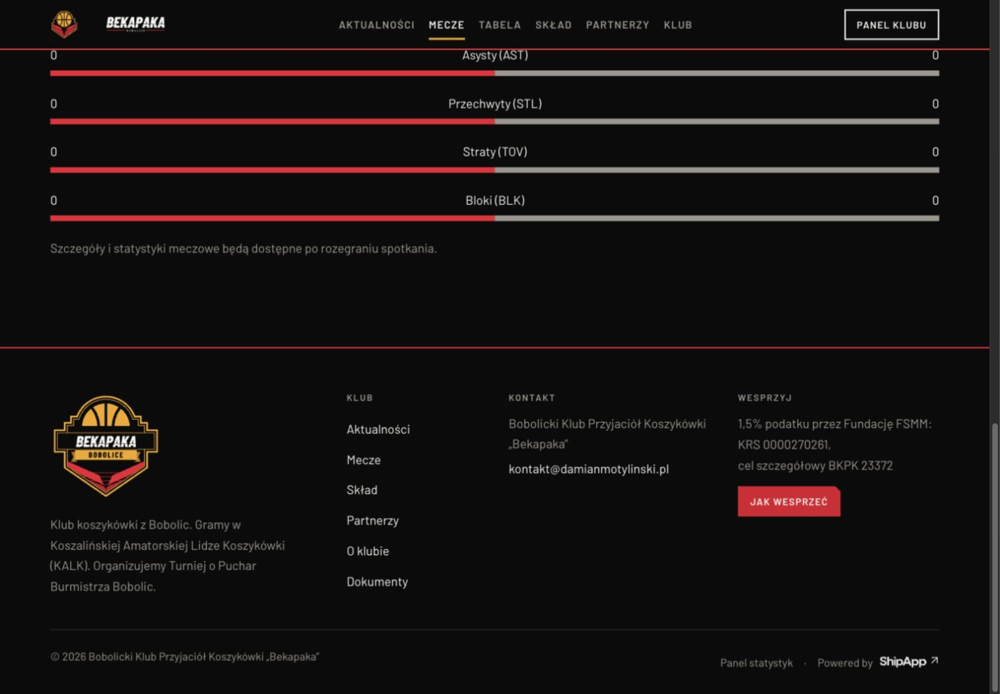
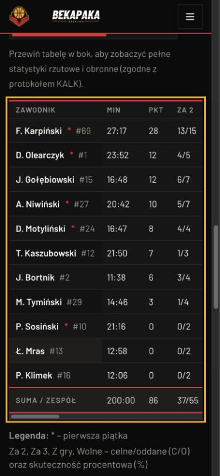

### 2. Artykuł i galeria: poprawiony plakat oraz fokus, niepełna redakcja

Plakat w całości i kontrast etykiety poprawiono. Link powrotu jest widoczny przy fokusie. Relacja nadal nie ma szybkiej nawigacji; galeria nie ma pełnych metadanych i stanów.

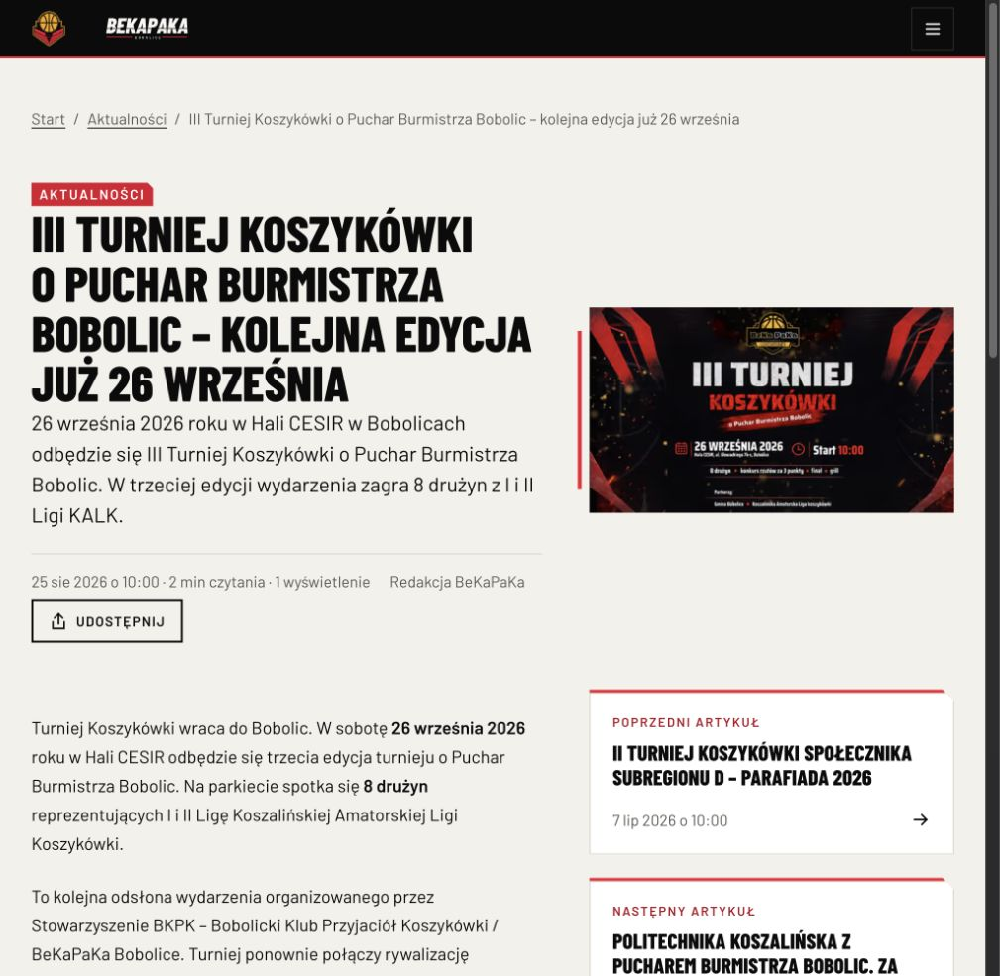
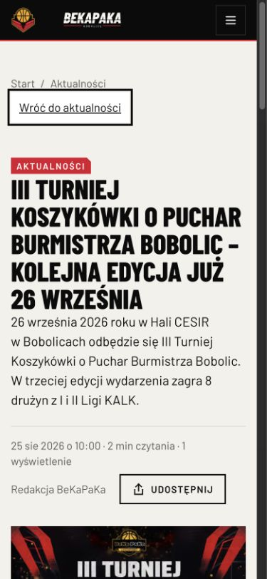
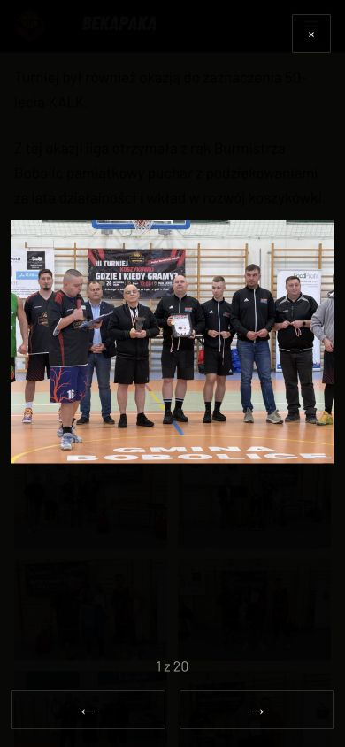

### 3. Aktualności: poprawione kategorie, otwarte archiwalne terminy

Wszystkie cztery kategorie są widoczne; historyczny trening nadal brzmi jak bieżący nabór.

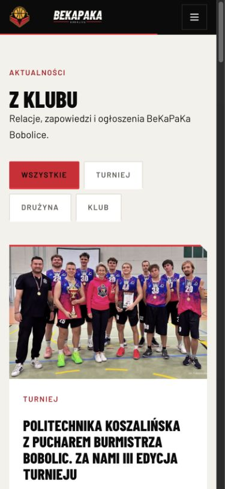
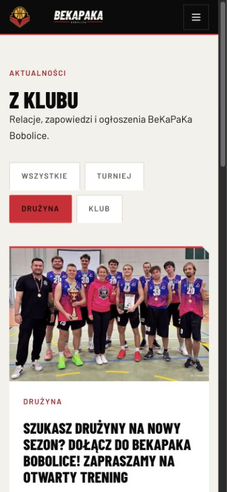

### 4. Skład i profil: działają osobne adresy, kontekst danych wymaga uzupełnienia

Lista ma 20 osób, 11 portretów i 9 placeholderów. Średnie profilu są bez maski; brak sezonu i mianowników procentów pozostaje.

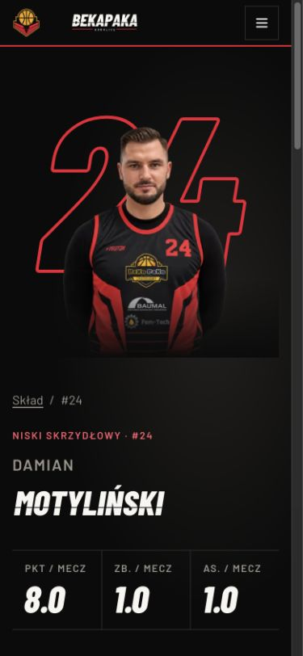

### 5. Tabela: czytelny scroll, częściowy kontekst

Przy scrollLeft 337 px sticky drużyna pozostaje przy x=16 px. Tabela ma 680 px we własnym kontenerze 343 px. Sezon i legenda są widoczne, ale aktualizacja/źródło sezonu nie są domknięte.

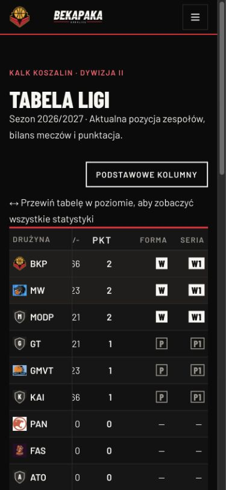

### 6. Klub, wsparcie i menu: działające kotwice oraz fokus

Kontakt i wsparcie mają skróty. Kopiowanie poprzedza QR i mieści się bez scrolla. Brak dostępnego komunikatu wyniku kopiowania; menu nie ma końcowej nazwy stowarzyszenia. Sprawdzono Shift+Tab z pierwszego przycisku do ostatniego linku, Escape i powrót do hamburgera.

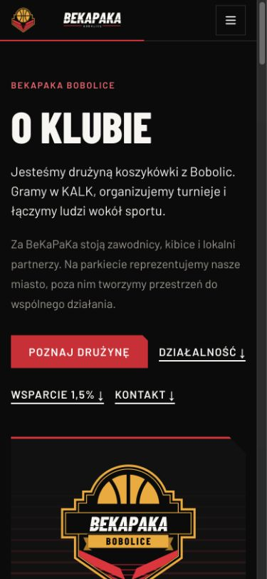
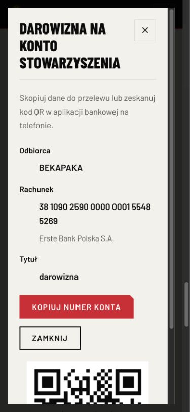

### 7. Partnerzy i dokumenty: działające dalsze akcje, niepełny odbiór

Partnerzy tworzą pełne trzy rzędy po pięć, ale oferta wymaga potwierdzenia. Dokumenty mają ścieżkę powrotu i kontaktu, lecz pusty czarny pas pozostał.

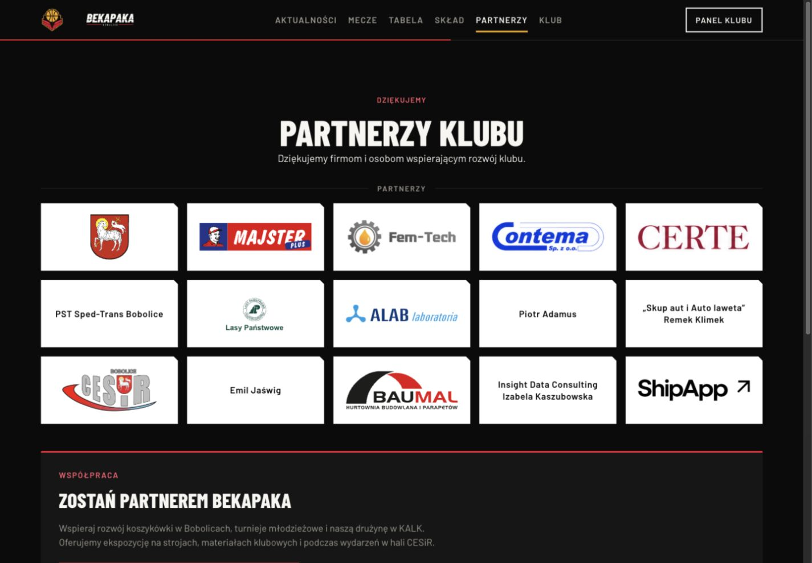
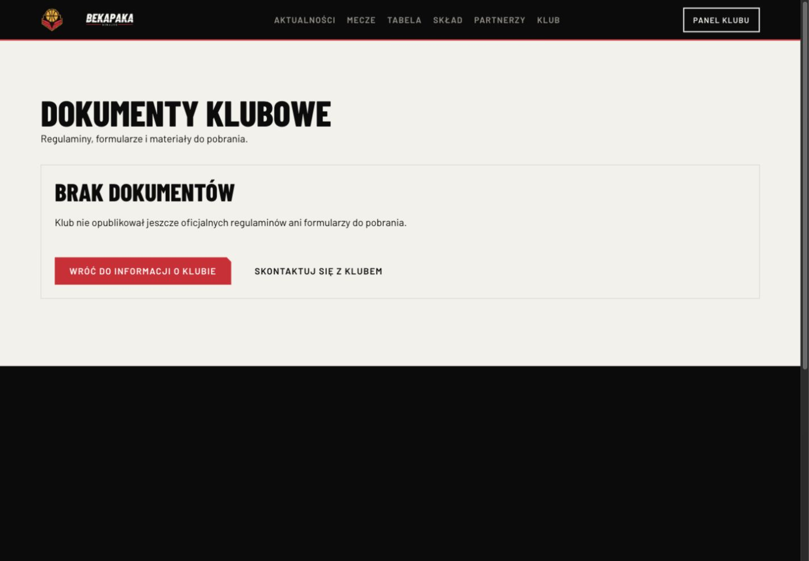

### 8. Produkcja: wcześniejszy interfejs, lokalny postęp nie jest wdrożeniem

Publiczną homepage odczytano i sfotografowano, bez logowania i bez działań na serwerze. To ograniczona kontrola jednej strony, nie pełny audyt produkcyjny.

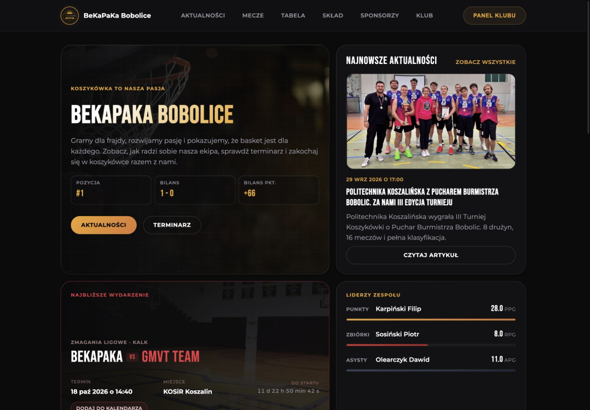

## Stan repozytorium i gotowość wdrożenia

HEAD lokalnego repozytorium to `7de521c` z 4.10.2026. W chwili kontroli było 96 zmienionych plików śledzonych; nowe elementy są także nieśledzone. Duża część kodu 2.0 oraz współdzielonych pakietów nie jest więc odzwierciedlona w tym commicie. Nie wykonano commit/push ani nie zmieniano istniejących prac użytkownika.

Poza UI istnieją zmiany backendu i panelu: współdzielona walidacja sześciu statusów meczu, administratorowy edytor presentation, endpoint aktualizacji i rewalidacja, kolumny presentation/presentationUpdatedAt dla Game/KalkMatch oraz migracja 20261005000000_match_presentation. Są również kolekcja CMS media-record i zmiany kontekstów Docker/CI do kopiowania współdzielonych pakietów. Testy jednostkowe i build panelu przechodzą; nie sprawdzano rzeczywistego zapisu edytora, działania migracji ani rewalidacji między uruchomionymi usługami.

**Nie ma podstaw do oznaczenia projektu jako w pełni odebranego lub wdrożonego.** Sam build strony nie weryfikuje obrazów Docker, uprawnień nowej kolekcji, integracji DB ani konfiguracji serwera. Przed osobno zleconym deployem należy zastosować runbooki z AGENTS.md oraz odbiór migracji, backupu i rollbacku. Ta sesja nie dotykała VPS ani MOYA.

## Kolejność domknięcia

1. Domknąć etap A: stany bez danych, podstawowy mobilny box score, powiększenie plakatu; utrzymać już poprawione linki, kontrast i fokus.
2. Wyjaśnić treści i źródła: oferta/kontakt, numer Sosińskiego, aktywny skład, kontekst rzutów, metadane zdjęć, historyczne terminy i dokumenty.
3. Dokończyć wspólne wzorce: shell/tło, krótszy homepage/stopka, skróty relacji, sizes miniatur, stan lightboxa i aria-live kopiowania.
4. Przeprowadzić odbiór: wszystkie sześć statusów, błędy/cache/offline, 375/390/430/768/1024/1440 px, zoom 200%, Safari/Firefox, czytniki, aktualny Lighthouse i transfery; integracje na izolowanej bazie/CMS.
5. Dopiero po odbiorze przygotować konkretny deploy z migracjami i rollbackiem. Obecny raport nie jest jego wykonaniem ani autoryzacją publikacji nowych treści.

## Ograniczenia

Brak nowych pomiarów Lighthouse, axe, HAR, INP i dotyku/swipe na urządzeniu; brak pełnych testów Safari/Firefox, VoiceOver/TalkBack, zoomu i wszystkich profili/statusów. Nie testowano cyklu publish/unpublish ani ręcznego edytora meczu na bazie. Test kopii schowka zakończono na odbiorze położenia kontrolki, kodu feedbacku oraz zamykania; nie weryfikowano odczytem schowka rzeczywistego sukcesu. Nie otwierano zewnętrznego Google Maps ani nie zatwierdzano adresu hali. Ocenę optyczną partnerów należy traktować jako obserwację wizualną, a nie decyzję o poziomach współpracy.

Dowody są przypisane do aktualnego lokalnego stanu i odczytu publicznej homepage. Nie przypisywano przyczyn ani dat wdrożenia tylko na podstawie czasu modyfikacji pliku. Różnice wysokości względem wcześniejszego raportu obejmują także bieżące dane i nową treść; nie są izolowanym benchmarkiem CSS.
