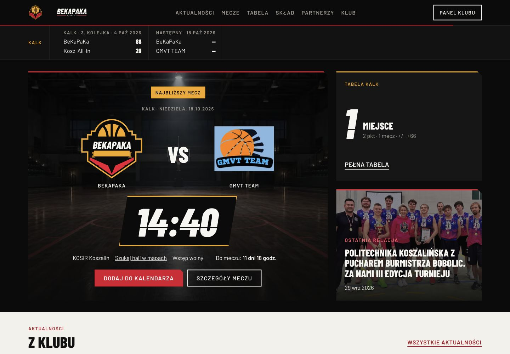
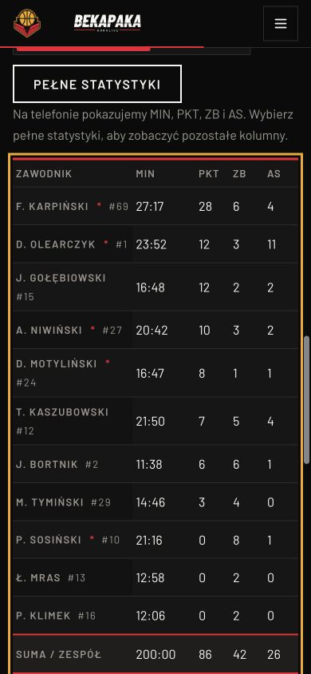

# Raport napraw i ponownego odbioru — BeKaPaKa 2.0

Data: 6 października 2026 · lokalnie · gałąź `codex/2.0` · zweryfikowany kod `035cff5`.

Zaimplementowano naprawy lokalnej wersji BeKaPaKa 2.0. Odbiór potwierdza 21 zamkniętych kryteriów, 12 częściowych i 1 otwarte; poprzednio było 5 / 20 / 9. Nie jest to pełna akceptacja publikacyjna: pozostają dane i zatwierdzenia klubu oraz wskazane niżej pomiary ręczne.

## Porównanie z poprzednim raportem

| Status | Poprzednio | Po naprawach |
|---|---:|---:|
| Zamknięte | 5 | 21 |
| Częściowe | 20 | 12 |
| Otwarte | 9 | 1 |

Bazą jest [raport stanu i postępu](../re-audit-2026-10-06/RAPORT-STAN-I-POSTEP.md), a punktem wyjścia prac zapis `1d95db8`. Poprzednich ocen i dowodów nie nadpisano. „Zamknięte” oznacza przyjęty zakres lokalnego kryterium; nie zastępuje zgód publikacyjnych ani odbioru innych silników.

## Wykonane zmiany

- Mecze: sześć statusów, brak danych zamiast pozornych zer, kompletne sumy/minuty, mobilne 5 kolumn oraz pełny widok ze sticky zawodnikiem, wspólne logotypy, kontekst sezonu i uczciwe wyszukiwanie hali. Szczegóły mają poprawne nagłówki i własny ekran ładowania.
- Artykuły: jawny imageFit/eventDate, cały plakat z powiększeniem, spis treści, metadata zdjęć i lokalny komunikat braków, licznik i oryginał, stany błędu/ponowienia. Poprawiono faktyczne slugi: iii-… to zapowiedź, 3-… to relacja.
- Homepage: 3 newsy, podgląd 5 zespołów wokół BeKaPaKa i 4 liderów, wszystkie 15 partnerów, krótsze wsparcie; stroje pozostają w klubie. Skrócenie 9099 → 7125 px przy 390 px (−21,7%) i 5535 → 4110 px przy 1440 px (−25,7%).
- Wspólne wzorce: kopiowanie przed QR i trwały status, krótsza stopka (1215 → około 874 px), cele linków ≥44 px, osiągalne menu na krótkim ekranie, pułapki/powrót fokusu i blokada scrolla. Neutralna współpraca oraz odnośniki do opublikowanych relacji zamiast dopisywania historii.
- CSS: wspólne komponenty wsparcia/ikony/blokada scrolla, scalone reguły okładki, breadcrumbs i sekcji; 6 identycznych historycznych reguł usunięto. To zakres napraw, a nie pełna przebudowa historycznego arkusza.

## Weryfikacja

| Sprawdzenie | Wynik |
|---|---|
| Strona — Vitest | 151/151, 24 pliki |
| Backend — Vitest | 109/109, 17 plików, w tym integracja Studio na PostgreSQL |
| Panel — Vitest | 6/6, 3 pliki; dwa komunikaty jsdom o niezaimplementowanym scrollTo |
| CMS — node:test | 9/9 |
| Typecheck / lint strony | Bez błędów i ostrzeżeń lint |
| Buildy | Next: 29 tras; Vite panelu i Strapi admin: sukces |
| Backend HTTP + lokalny PostgreSQL | 401 bez tokenu, 403 bez roli admina, uprawniony PATCH, trwałe zero i timestamp, publiczny odczyt, stary format tablicy, nowe metadata, rewalidacja Next przez HTTP |
| CMS HTTP + osobny SQLite | Szkic ukryty, publikacja z metadanymi, wycofanie ukryte, imageFit/eventDate |
| Responsywność | 12 tras × 6 szerokości = 72 pomiary; brak overflow dokumentu |
| Dostępność | Axe: 0 naruszeń w badanym zakresie na 9 podstronach; ograniczenia poniżej |

Lokalny test PostgreSQL został zatrzymany po zakończeniu. Skrypty CMS usuwają własną tymczasową bazę. Nie użyto bazy produkcyjnej, zapisu do zdalnego CMS, deployu, pushu, scrapingu ani dostępu do VPS/MOYA.

Szczegółowe wyniki i polecenia odtworzenia: [README](README.md), [summary.json](summary.json), [responsive.json](responsive.json), [accessibility.json](accessibility.json), [browser-evidence.json](browser-evidence.json) oraz zapisane logi `*.txt`.

## Lighthouse lokalnego buildu

| Widok | Performance | Accessibility | Best practices | SEO | LCP | CLS | Transfer |
|---|---:|---:|---:|---:|---|---|---:|
| [Homepage · desktop](lighthouse-home-desktop.json) | 98 | 100 | 100 | 100 | 1.2 s | 0 | 990 KiB |
| [Homepage · telefon](lighthouse-home-mobile.json) | 93 | 100 | 100 | 100 | 3.1 s | 0 | 519 KiB |
| [Relacja · telefon](lighthouse-article-mobile.json) | 95 | 100 | 100 | 100 | 2.9 s | 0 | 376 KiB |
| [Mecz · telefon](lighthouse-match-mobile.json) | 92 | 100 | 100 | 100 | 3.4 s | 0 | 384 KiB |

Pomiar meczu przed ostatnią korektą: performance 77, accessibility 99, CLS 0,272. Po korekcie kolejności nagłówków i rezerwacji miejsca dla ładowania: performance 92, accessibility 100, CLS 0. [Zachowany pomiar przed korektą](lighthouse-match-mobile-before-loading-fix.json).

## Macierz wykonania 34 kryteriów

| ID | Kryterium | Poprzednio → teraz | Weryfikacja / pozostałe prace |
|---|---|---|---|
| UI-01 | Jeden sposób otwierania szczegółów meczu | Zamknięte → **Zamknięte** | Zachowano bezpośrednie adresy meczów i powrót do widoku wyników. |
| UI-02 | Usunąć instrukcję administracyjną z widoku kibica | Częściowe → **Zamknięte** | Sześć statusów ma odrębne komunikaty, a błąd strony akcję ponowienia. Testy statusów i lokalny odczyt. |
| UI-03 | Jeden wynik i jedna hierarchia strony meczu | Częściowe → **Zamknięte** | Jeden wynik; porównania wyłącznie dla LIVE/BREAK/FINAL i par kompletnych statystyk. Zaplanowany mecz nie ma tabeli ani pozornych zer. Hierarchia sekcji h2 oraz osobny ekran ładowania zapobiegający skokowi stopki. |
| UI-04 | Przebudować mobilny box score | Częściowe → **Zamknięte** | 375/390/430 px: 5 widocznych kolumn, tabela 343/358/398 px. Pełny widok ma sticky zawodnika; brak danych = —. |
| UI-05 | Plakat powinien być widoczny w całości | Częściowe → **Zamknięte** | Plakat iii-… ma contain, odczyt oryginału i powiększenie klawiaturą. Relacja 3-… zachowuje fotograficzny kadr. |
| UI-06 | Naprawić tokeny i kontrast etykiety artykułu | Zamknięte → **Zamknięte** | Zachowano zatwierdzone role etykiet. Brak nowych naruszeń axe/Lighthouse; wcześniejsze pomiary kontrastu pozostają w raporcie bazowym. |
| UI-07 | Nie zostawiać niewidocznego linku w kolejności Tab | Zamknięte → **Zamknięte** | Powrót ma widoczny cel i obrys; odnośniki breadcrumb mają minimum 44 px. |
| UI-08 | Uzupełnić opisy zdjęć i autora | Częściowe → **Częściowe** | CMS przekazuje podpis i autora; lokalny podgląd oznacza braki, publiczny filtr zatwierdzonych mediów działa. Brak rzeczywistych zatwierdzeń i kompletu opisów/autorów. |
| UI-09 | Zatwierdzić publiczny kontakt klubu | Otwarte → **Otwarte** | Jeden siteSettings.contactEmail, bez wymyślonego maila. Właściciel nie zatwierdził jeszcze kontakt@damianmotylinski.pl jako kontaktu klubu. |
| UI-10 | Dać dalszą akcję w pustych dokumentach | Częściowe → **Zamknięte** | Pusty stan ma działające linki do klubu i kontaktu; papier kończy się dokładnie przy stopce. Dokumenty oczekują na dostarczenie. |
| UI-11 | Skrócić drugą połowę strony głównej | Otwarte → **Zamknięte** | Homepage 390 px: 9099 → 7125 px (−21,7%); 1440 px: 5535 → 4110 px (−25,7%). Zachowano wyniki, najbliższy mecz, 3 newsy, tabelę, liderów i wszystkich partnerów. |
| UI-12 | Ujednolicić znaki rywala i nazwy kolejki | Częściowe → **Zamknięte** | Znaki rywala są uzupełniane z tej samej tabeli ligi; nazwa kolejki ma wspólny schemat. GMVT sprawdzony w hero i szczegółach. |
| UI-13 | Dodać prostą akcję dojazdu na mecz | Częściowe → **Częściowe** | Link nazwano uczciwie „Szukaj hali w mapach”; usunięto dopisywanie miasta. Dokładny adres/geolokalizacja wszystkich hal nadal wymaga źródła. |
| UI-14 | Pokazać sezon, dywizję i świeżość danych | Częściowe → **Częściowe** | Nowe opt-in API sezon/dywizja/data wierszy, zachowany stary format tablicy. Brak daty nie daje 1970 ani bieżącego czasu. Lokalny podgląd czyta starszy backend: niepotwierdzony sezon i aktualizacja pozostają jawne. |
| UI-15 | Wyjaśnić skróty i ujednolicić serię | Częściowe → **Zamknięte** | Legenda wszystkich kolumn, polska seria i opisy wygrana/porażka dla czytnika; nazwa zespołu pozostaje sticky. |
| UI-16 | Uporządkować kompletność składu | Częściowe → **Częściowe** | Nie usuwano zawodników bez zdjęcia. Fallback numeru klubowego opisano. Aktywność, pozycje i numer Sosińskiego wymagają potwierdzenia danych. |
| UI-17 | Dać sezon i kontekst statystyk profilu | Częściowe → **Częściowe** | Kontekst sezonu/liczby meczów, celne/próby, 0/0 = — i objaśnienia wskaźników. W podglądzie sezon nadal niepotwierdzony, bo źródłowy backend nie ma jeszcze nowych pól. |
| UI-18 | Ograniczyć cięcia do danych ekspozycyjnych | Częściowe → **Częściowe** | Cięcia usunięto z nazwiska i 404; pozostały role ekspozycyjne. Safari/Firefox oraz czytelność wszystkich cyfr w tych silnikach nie zostały odebrane. |
| UI-19 | Pokazać wszystkie kategorie na telefonie | Zamknięte → **Zamknięte** | Zachowano mobilne kategorie, linki i reset paginacji. |
| UI-20 | Oznaczać historyczne zapowiedzi | Otwarte → **Zamknięte** | Jawne eventDate w CMS i dwie zweryfikowane daty lokalne. Trening oraz zapowiedź III turnieju oznaczone historycznie; bez zgadywania z tekstu. |
| UI-21 | Dodać skróty do długiej relacji | Otwarte → **Zamknięte** | Spis treści relacji prowadzi m.in. do galerii i klasyfikacji. Kotwica klasyfikacji ma top 152 px przy headerze 60 px; unikalne ID i zwykłe odnośniki hash. |
| UI-22 | Uprościć metadane i breadcrumb | Częściowe → **Zamknięte** | Breadcrumb używa kategorii zamiast pełnego tytułu; autor i udostępnianie pozostają; cele 44 px. |
| UI-23 | Powiększyć użyteczne zdjęcie w lightboxie | Częściowe → **Zamknięte** | Zdjęcie ma 358 px przy viewport 390; licznik 2 z 20, strzałki, Escape, pułapka i powrót fokusu. Potwierdzony stan błędu oraz skuteczne ponowienie pobrania. Fizycznego gestu swipe nie potwierdzono: IAB nie obsługuje dispatchTouchEvent; zachowano handler i poprawiono jego warunek. |
| UI-24 | Dopasować sizes do kolumny artykułu | Otwarte → **Częściowe** | Warianty sizes dla okładki i galerii, eagerness okładki oraz dodatkowe szerokości optymalizatora. Zapisano currentSrc/DPR 1 i transfer Lighthouse. Nie ma porównywalnego HAR przed/po ani odbioru DPR 2/3. |
| UI-25 | Dopracować optyczną wagę logotypów | Częściowe → **Częściowe** | Wszyscy 15 partnerzy i ShipApp zachowani, kompaktowa siatka i korekta pola logo Lasów. Ostateczna optyczna aprobata znaków/pól ochronnych pozostaje po stronie klubu. |
| UI-26 | Dodać jasny krok do współpracy | Częściowe → **Zamknięte** | Neutralna propozycja współpracy i kontakt z konfiguracji; brak fikcyjnych pakietów i kwot. Formalne zatwierdzenie adresu nadal w UI-09. |
| UI-27 | Pokazać ludzi i fakty, ograniczyć ogólniki | Otwarte → **Częściowe** | Ogólną sekcję wartości zastąpiono linkami do dwóch faktycznie opublikowanych relacji. Brak zatwierdzonego zdjęcia życia klubu i historii ze źródłami. |
| UI-28 | Dodać skróty do długiej strony klubu | Zamknięte → **Zamknięte** | Działalność, wsparcie i kontakt dostępne przez kotwice; zachowano semantyczne nagłówki. |
| UI-29 | Na telefonie pokazać kopiowanie przed QR | Częściowe → **Zamknięte** | Kopiowanie przed QR, trwały role=status i ręczny fallback błędu; sukces i Escape/powrót fokusu potwierdzone. Dane rachunku i FSMM zachowane. |
| UI-30 | Skrócić stopkę na telefonie | Otwarte → **Zamknięte** | Stopka 390 px: około 1215 → 874 px; kontakt przed linkami, 2 kolumny linków na telefonie. Najmniejszy cel odnośnika 44 px, również ShipApp. |
| UI-31 | Poprawić wysokość i tło krótkich podstron | Częściowe → **Częściowe** | Flex main zastąpił min-height wyliczany od headera. Papier styka się ze stopką przy 768/1024 px. Prawdziwy zoom 200% nie jest potwierdzony: klawisz zoomu nie zmienia viewportu w IAB. |
| UI-32 | Domknąć menu i zachować sprawne zamykanie | Otwarte → **Zamknięte** | Nazwa organizacji, wszystkie linki osiągalne przy 390×500, Tab/Shift+Tab w menu, Escape przywraca fokus po animacji, scroll jest odblokowany. |
| UI-33 | Uprościć kaskadę CSS po migracji | Otwarte → **Częściowe** | Scalono okładkę/breadcrumb/bazowe sekcje, usunięto 6 identycznych historycznych reguł i martwy wariant darowizny. Wspólne ikony i blokada scrolla. Cały historyczny arkusz nadal wymaga szerszej konsolidacji. |
| UI-34 | Uzupełnić pomiary i stany przed odbiorem | Częściowe → **Częściowe** | Nowe wyniki testów, typecheck/lint/build, izolowane integracje, axe, Lighthouse i resource timing. Pozostają ręczny odbiór kolorów, VoiceOver, Safari/Firefox, zoom i pełny HAR przed/po. |

## Granice odbioru i dalsze zależności

- Kontakt klubu, aktywność i pozycje zawodników, numer Sosińskiego, autorzy/opisy/zgody zdjęć oraz zdjęcie życia klubu i historia ze źródłami wymagają potwierdzeń. Nie wprowadzono fikcyjnych danych ani zmian do zdalnego CMS.
- Podgląd 3100 używa nowego frontendu i publicznego, starszego backendu. Dlatego etykiety „sezon niepotwierdzony” i nieznana aktualizacja są celowe. Nowy kontrakt API i trwałość danych potwierdzono na osobnej lokalnej bazie. Nie przeprowadzono całego scenariusza przez kliknięcia panelu administratora; zapis i rewalidację sprawdzono rzeczywistym HTTP.
- Axe WCAG 2 A/AA i 2.1 AA: 0 wykrytych naruszeń na 9 podstronach. Cztery widoki pozostawiły color-contrast do ręcznej kontroli ze względu na obrazy/przesłonięcie; nie jest to pełna deklaracja zgodności WCAG. Lighthouse uzupełnił kontrolę m.in. o kolejność nagłówków.
- Safari, Firefox i VoiceOver nie zostały odebrane. Native zoom 200% w IAB nie zmienił viewportu, więc nie zaliczono tego testu. Próba gestu CDP została odrzucona przez IAB; fizycznego swipe nie zaliczono. Działanie strzałek, Escape, pułapek i powrotu fokusu potwierdzono.
- Zapisano currentSrc/sizes dla DPR 1 i resource timing, ale nie ma porównywalnego HAR przed/po ani odbioru DPR 2/3. Browser może zachować wcześniej pobrany większy wariant; puste currentSrc w zapisie oznaczają obraz lazy przed pobraniem. Wyników transferu lokalnego podglądu nie należy utożsamiać z produkcją.
- Lighthouse to pojedyncze kontrolowane uruchomienia istniejącego narzędzia na headless Chromium/Brave. Mobile LCP wyniósł 2,9–3,4 s; nie deklarujemy osiągnięcia ≤2,5 s. CLS w końcowych pomiarach wynosi 0.

## Zapis prac

Commity implementacji: `99e8509` (dane meczów), `68aa9e1` (artykuły/treści), `e7b4247` (homepage/wsparcie/wzorce), `035cff5` (izolowane integracje, dostępność, ładowanie i odbiór techniczny). Dokumentacja odbioru jest osobnym lokalnym commitem.

